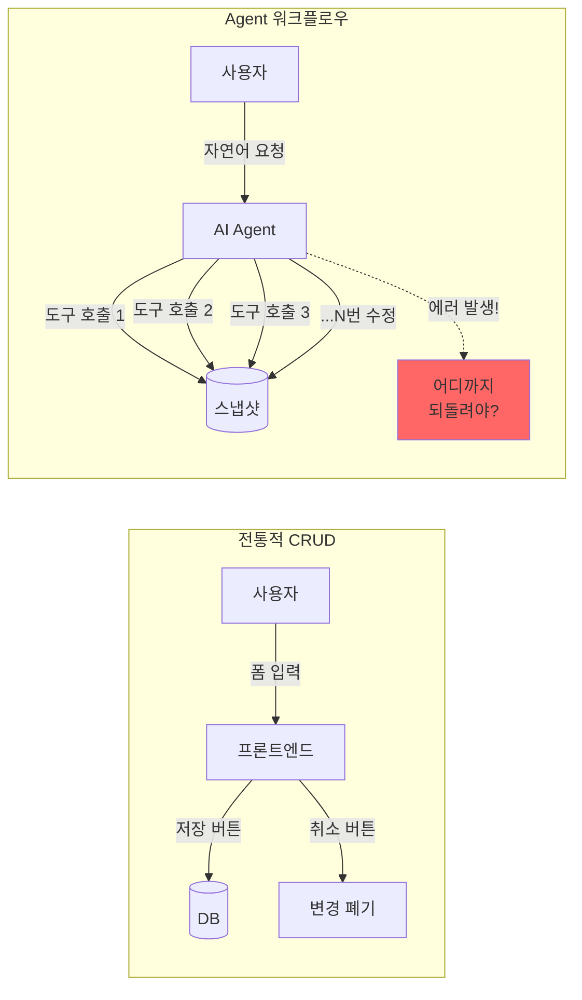
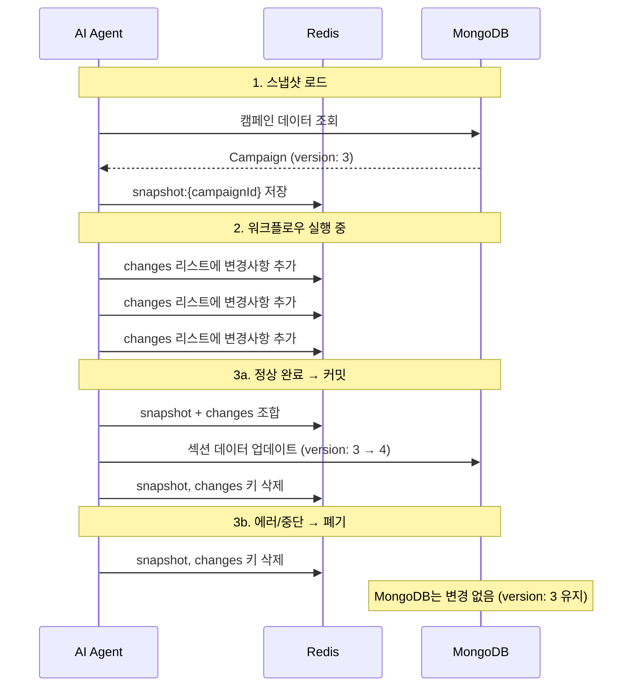
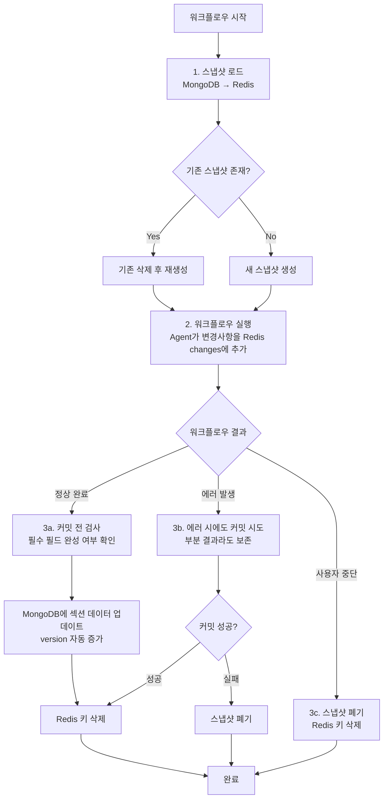
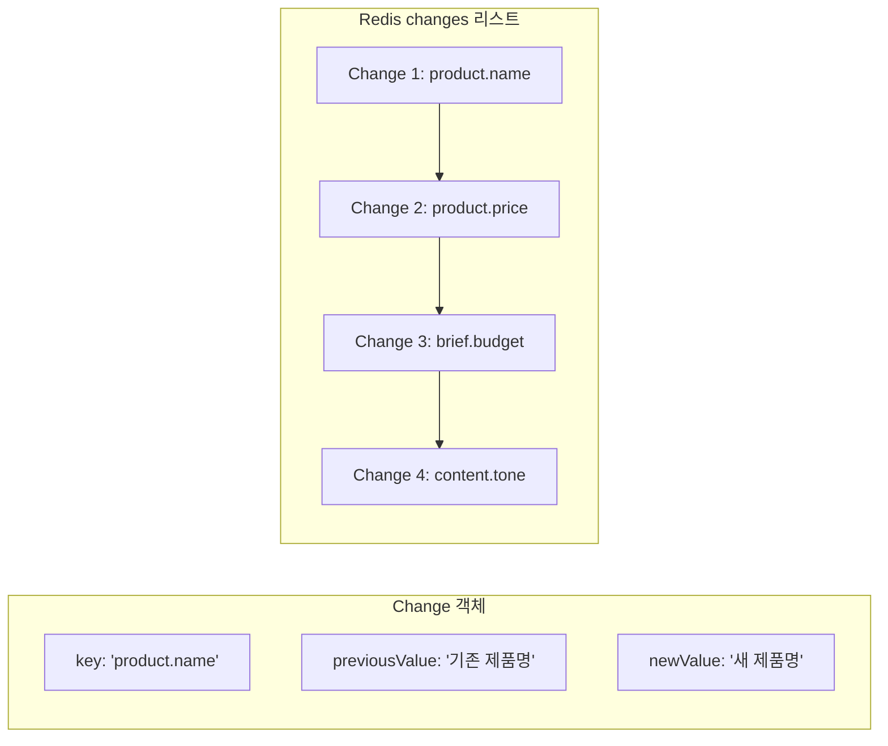
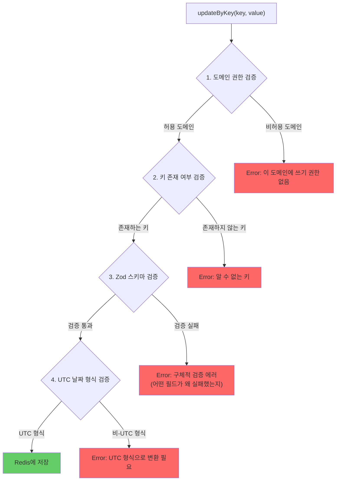
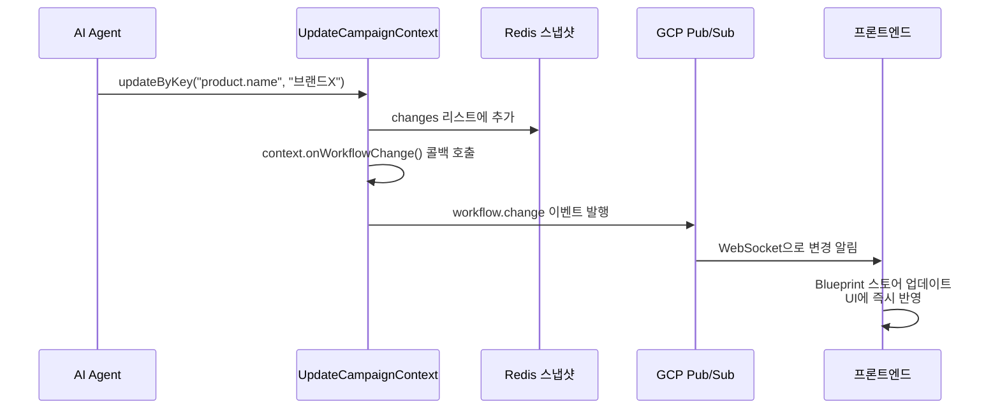
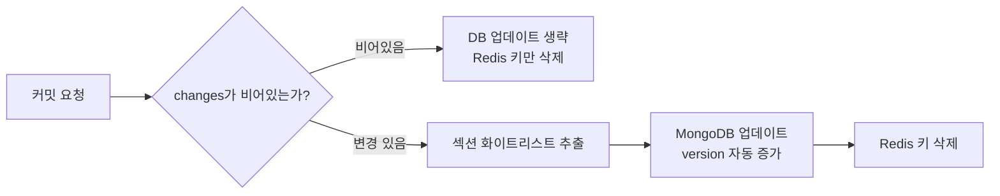

# AI가 실수하면 어떡하지? -- 되돌릴 수 있게 만들자

AI Agent가 캠페인 데이터를 직접 수정합니다. "제품 가격을 30,000원으로 설정해줘"라고 하면 즉시 반영됩니다. 그런데 Agent가 잘못된 값을 넣거나, 사용자가 마음을 바꾸거나, 워크플로우 중간에 에러가 나면? 이미 수정된 데이터를 어떻게 되돌릴까요? Redis 기반 스냅샷/롤백 패턴으로 이 문제를 해결한 과정을 정리합니다.

## 왜 스냅샷이 필요한가

### AI Agent의 데이터 수정은 위험하다

전통적 CRUD 앱에서는 사용자가 폼에 값을 입력하고 "저장" 버튼을 누릅니다. 실수해도 "취소"를 누르면 됩니다. 하지만 Agent 워크플로우에서는 상황이 다릅니다.

Agent는 한 번의 워크플로우에서 10-20번 데이터를 수정합니다. 5개 서브에이전트가 동시에 실행되면 수정 횟수는 더 늘어납니다. 이 중간에 에러가 발생하면?

| 시나리오 | 문제 | 영향 |
|---|---|---|
| Agent가 잘못된 값 입력 | 예산을 300만원 대신 3억원으로 설정 | 다운스트림 계산 전부 오류 |
| 워크플로우 중간 에러 | 3번째 서브에이전트에서 API 타임아웃 | 1,2번 결과는 반영, 3,4,5번은 미완성 |
| 사용자 중단 (interrupt) | "아, 잠깐. 방향을 바꿀게" | 일부만 수정된 불완전 상태 |
| 동시 접속 충돌 | 두 사용자가 같은 캠페인을 동시에 수정 | 데이터 불일치 |

DB에 직접 쓰면 이 모든 시나리오에서 "반쯤 수정된" 불완전한 상태가 영속됩니다.

## Redis 스냅샷 패턴

### 핵심 아이디어: Copy-on-Write

데이터베이스(MongoDB)에 직접 쓰지 않습니다. 워크플로우 시작 시 캠페인 데이터를 Redis에 복사(스냅샷)하고, 모든 변경사항을 Redis에만 기록합니다. 워크플로우가 정상 완료되면 MongoDB에 커밋하고, 실패하면 Redis를 폐기합니다.

### Redis 키 구조

| Redis 키 | 타입 | 내용 | TTL |
|---|---|---|---|
| `snapshot:{campaignId}` | String (JSON) | 원본 캠페인 데이터 | 워크플로우 타임아웃 + 30초 |
| `snapshot:{campaignId}:changes` | List (JSON[]) | 변경사항 리스트 | 워크플로우 타임아웃 + 30초 |

TTL을 설정하는 이유는 안전장치입니다. 워크플로우가 비정상 종료되어 cleanup이 실행되지 못하면, Redis에 스냅샷이 영원히 남게 됩니다. TTL이 이를 자동으로 정리합니다.

## 스냅샷 → 실행 → 커밋/롤백 플로우

### 상세 플로우

### 에러 시에도 커밋을 시도하는 이유

워크플로우 중간에 에러가 발생해도 바로 롤백하지 않습니다. 대신 커밋을 먼저 시도합니다. 예를 들어, 5개 서브에이전트 중 4개가 성공하고 1개가 실패했다면, 4개의 결과라도 저장하는 것이 사용자에게 유리합니다.

커밋 자체가 실패한 경우에만 스냅샷을 폐기합니다.

## 변경사항 추적 (Change Tracking)

Agent가 값을 수정할 때마다 Change 객체가 생성됩니다.

변경사항을 순서대로 리스트에 쌓는 방식입니다. 조회할 때는 원본 스냅샷에 changes를 순서대로 적용하여 현재 상태를 재구성합니다. 이 방식의 장점은 다음과 같습니다.

1. **변경 이력 추적**: 어떤 필드가 어떤 순서로 변경되었는지 완벽히 기록
2. **이전 값 복원 가능**: 각 Change에 previousValue가 포함되어 있어 롤백 시 이전 값 복원 가능
3. **원본 보존**: 원본 스냅샷은 변경되지 않으므로, changes를 무시하면 즉시 원본 상태로 돌아감

## Zod 스키마 검증

Agent가 값을 업데이트할 때 3단계 검증을 거칩니다.

### 검증 계층 상세

| 검증 단계 | 검증 대상 | 실패 시 에러 메시지 |
|---|---|---|
| 도메인 권한 | Agent가 자신의 담당 섹션에만 쓰는지 | "Cannot update 'brief.budget'. This tool is restricted to [product] domains." |
| 키 존재 | 정의된 캠페인 키인지 | "Unknown key 'product.xyz'. Please use a valid campaign context key." |
| Zod 스키마 | 값의 타입과 형식이 올바른지 | "Invalid value for 'brief.budget'. Validation errors:\n- value: Expected number, received string" |
| UTC 날짜 | 모든 날짜 값이 UTC 형식인지 | "'2025-05-01T09:00:00+09:00' is not UTC. Convert to UTC and use 'Z' suffix." |

검증 실패 시 Agent에게 **구체적인 에러 메시지**를 반환합니다. "잘못된 값입니다"가 아니라 "어떤 필드가 왜 실패했는지"를 알려주어, Agent가 스스로 값을 수정하고 재시도할 수 있게 합니다.

### 날짜 검증이 특별한 이유

날짜 검증은 재귀적으로 수행됩니다. 값이 객체나 배열인 경우, 내부의 모든 문자열을 검사하여 날짜 패턴이 발견되면 UTC 여부를 확인합니다. 이는 Agent가 `{ startDate: "2025-05-01T09:00:00+09:00", endDate: "2025-06-01" }` 같은 복합 객체를 전달할 때도 내부의 비-UTC 날짜를 잡아내기 위함입니다.

## 실시간 변경 알림

Agent가 값을 업데이트하면, 스냅샷 저장과 동시에 클라이언트에 실시간으로 알립니다.

사용자는 Agent가 데이터를 수정하는 순간을 실시간으로 볼 수 있습니다. "아, 지금 제품명을 바꿨구나"를 확인하면서 대화를 이어갈 수 있어 UX가 크게 향상됩니다.

## 커밋 시점의 안전장치

### 섹션 화이트리스트

커밋 시 캠페인 데이터를 그대로 MongoDB에 저장하지 않습니다. 정의된 섹션 이름(product, brief, content, contract, outreach, recruitment)만 화이트리스트로 추출하여 저장합니다. Agent가 메타 필드(id, version, createdAt 등)를 실수로 수정해도 DB에 반영되지 않습니다.

### 빈 변경사항 처리

changes 리스트가 비어있으면 MongoDB 업데이트를 생략합니다. 불필요한 DB 쓰기를 방지하고, version 증가도 발생하지 않습니다.

## 핵심 인사이트

- **AI Agent의 데이터 수정에는 트랜잭션 개념이 필수**: Agent가 한 번의 워크플로우에서 10-20번 수정하므로, "전부 반영 또는 전부 폐기"가 가능해야 데이터 일관성 보장
- **Redis를 스테이징 영역으로 활용하면 DB 부하 없이 롤백 가능**: 원본 DB는 커밋 시점까지 변경되지 않으므로, 롤백은 Redis 키 삭제만으로 완료. DB 트랜잭션 롤백보다 훨씬 가볍고 빠름
- **변경사항을 리스트로 쌓는 Event Sourcing 방식이 감사 추적의 핵심**: 각 Change에 key, previousValue, newValue가 기록되어 "언제, 무엇이, 어떻게 변경되었는지" 완벽히 추적 가능
- **검증 실패 시 구체적 에러 메시지가 Agent 자가 수정을 유도**: "잘못된 값" 대신 "budget 필드가 number 타입이어야 하는데 string을 받았음"이라고 알려주면, Agent가 스스로 수정 가능
- **에러 시에도 커밋을 먼저 시도하는 것이 사용자 친화적**: 5개 서브에이전트 중 4개가 성공했다면, 4개의 결과라도 저장하는 것이 처음부터 다시 하는 것보다 유리
- **TTL 기반 자동 정리가 좀비 스냅샷을 방지**: 워크플로우가 비정상 종료되어 cleanup이 실행되지 못해도, Redis TTL이 자동으로 스냅샷을 정리하여 메모리 누수 방지
