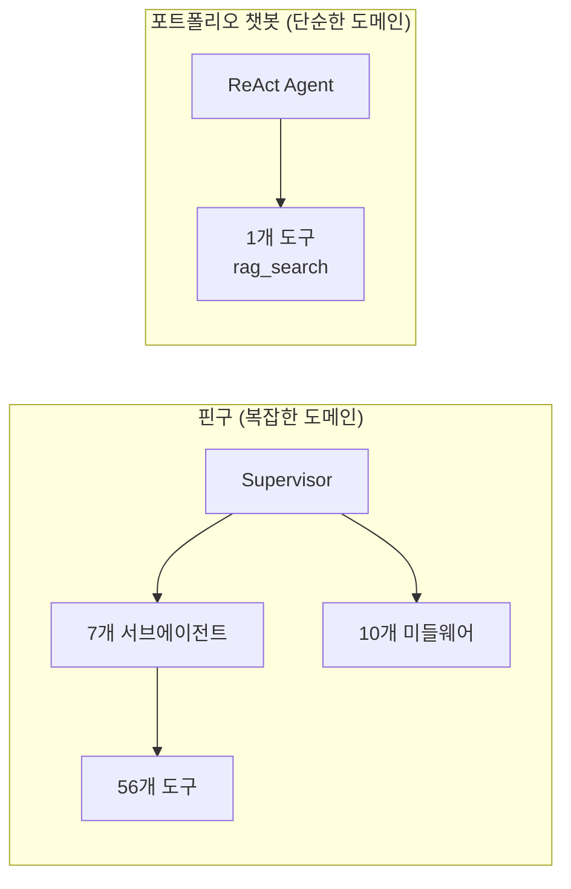
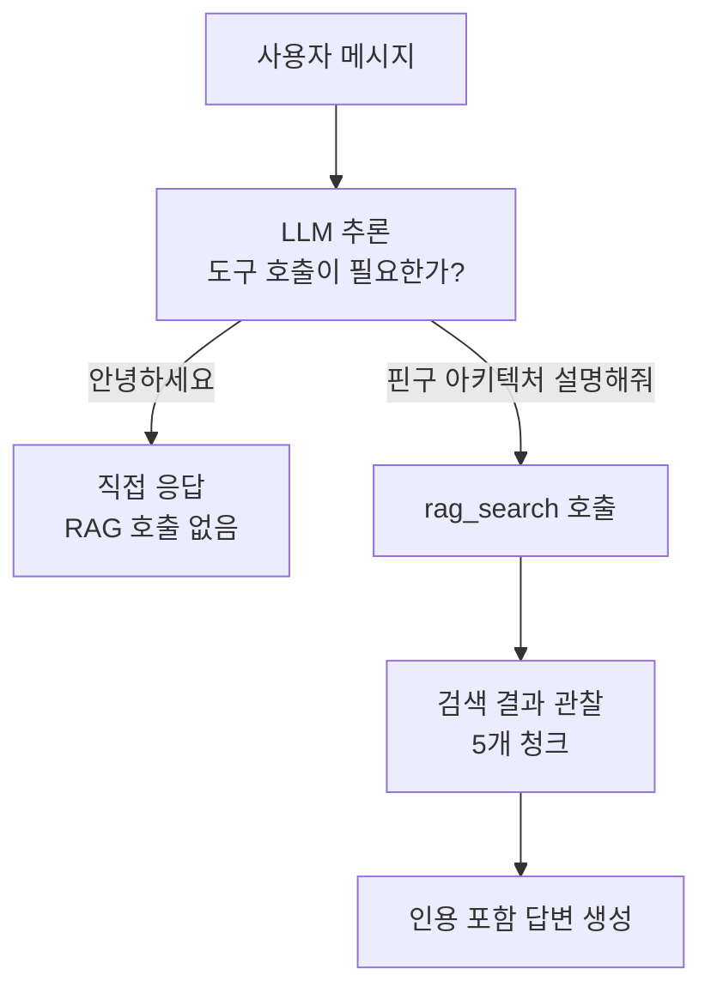
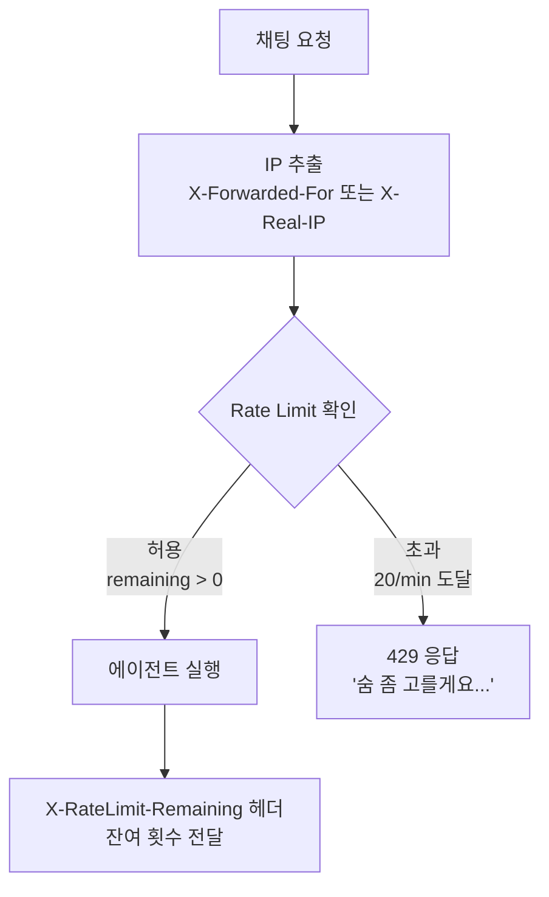
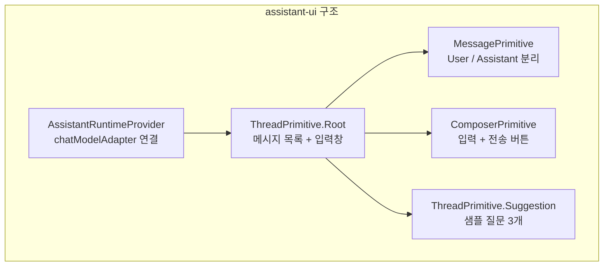

# LangGraph ReAct 에이전트와 방어적 운영 설계

16줄의 코드로 구성된 LangChain v1 ReAct 에이전트가 어떻게 조건부 도구 호출, rate limiting, 에러 분류를 통해 프로덕션 환경에서 안정적으로 동작하는지 정리합니다.

## 에이전트 설계 철학

이 챗봇의 에이전트 설계에서 가장 중요한 원칙은 **"간결함이 곧 안정성"**입니다.

핀구의 Supervisor-Subagent 패턴(7개 에이전트, 56개 도구, 10개 미들웨어)과 비교하면, 이 프로젝트는 의도적으로 단순합니다. 포트폴리오 챗봇에 필요한 것은 **"질문에 맞는 데이터를 찾아 답변하기"** 하나뿐입니다.



## 왜 ReAct 패턴인가

| 패턴 | 구조 | 적합한 경우 |
|---|---|---|
| 단순 RAG Chain | 매번 검색 → LLM | 모든 질문에 검색이 필요한 경우 |
| **ReAct Agent** | **LLM이 도구 호출 여부를 판단** | **검색이 필요한 질문과 아닌 질문이 섞인 경우** |
| Multi-Agent | 여러 에이전트가 협업 | 복잡한 도메인, 다수 도구 |

ReAct 패턴을 선택한 이유: "안녕하세요"에는 RAG 없이 바로 인사하고, "핀구의 멀티에이전트를 설명해줘"에는 RAG를 호출해야 합니다. **도구 호출 판단을 LLM에 위임**하면 이 분기를 코드로 작성할 필요가 없습니다.

## 에이전트 구현: 16줄

```typescript
import { createAgent } from "langchain";
import { ChatXAI } from "@langchain/xai";
import { SYSTEM_PROMPT } from "./prompts/system.prompt";
import { ragSearchTool } from "./tools/rag-search.tool";
import { env } from "../config/env";

const llm = new ChatXAI({
  apiKey: env.XAI_API_KEY,
  model: "grok-4-1-fast-reasoning",
});

export const agent = createAgent({
  model: llm,
  tools: [ragSearchTool],
  systemPrompt: SYSTEM_PROMPT,
});
```

LangChain v1의 `createAgent`가 ReAct 루프(추론 → 행동 → 관찰 → 추론...)를 자동으로 구성합니다. 기존 `createReactAgent`(LangGraph prebuilt)를 대체하는 새 표준 API로, `SystemMessage` 래핑 없이 `systemPrompt` 문자열을 직접 전달하는 더 간결한 인터페이스를 제공합니다.



## 시스템 프롬프트 설계

```
당신은 김형진의 개인 AI 어시스턴트입니다.
방문자의 질문에 제공된 컨텍스트를 기반으로 답변합니다.

규칙:
- 컨텍스트에 없는 정보는 추측하지 마세요.
- RAG 검색 결과가 제공되면, 반드시 관련 소스를 인용 번호([1], [2] 등)로 참조하세요.
- 한국어로 답변하되, 기술 용어는 원문 유지.
- 친절하고 전문적인 톤을 유지하세요.
- 인사말이나 일반 대화에는 RAG 검색 없이 직접 답변하세요.
```

5줄의 규칙이 에이전트의 행동을 결정합니다:

| 규칙 | 목적 |
|---|---|
| "추측하지 마세요" | Hallucination 방지 — 모르면 모른다고 답변 |
| "인용 번호로 참조" | 출처 추적 가능성 확보 — 신뢰도 향상 |
| "기술 용어는 원문 유지" | "LangGraph"를 "랭그래프"로 번역하지 않도록 |
| "인사말에는 RAG 없이" | 불필요한 도구 호출 방지 — 비용 절감 |

마지막 규칙이 특히 중요합니다. "안녕하세요"에 RAG를 호출하면 임베딩 API + 벡터 검색 비용이 낭비됩니다. 시스템 프롬프트에서 명시하면 LLM이 도구 호출을 건너뛰도록 학습합니다.

## RAG 도구: 검색 결과 포맷팅

```typescript
export const ragSearchTool = tool(
  async ({ query }) => {
    const results = await retrieve(query);
    lastSearchResults = results;  // 인용 매핑용 저장

    if (results.length === 0) return "관련 정보를 찾지 못했습니다.";

    return results
      .map((r, i) => `[${i + 1}] (${r.source})\n${r.text}`)
      .join("\n\n---\n\n");
  },
  {
    name: "rag_search",
    description: "김형진의 경력, 프로젝트, 기술 스택, 학력 등에 대한 정보를 검색합니다.",
    schema: z.object({
      query: z.string().describe("검색 쿼리 (한국어 또는 영어)"),
    }),
  }
);
```

검색 결과를 LLM에 전달할 때 `[1] (source)\n내용` 포맷을 사용합니다. LLM이 답변에서 `[1]`로 인용하면, 스트리밍 완료 후 클라이언트에서 클릭 가능한 링크로 변환됩니다.

`lastSearchResults`를 모듈 스코프 변수로 저장하는 이유: LangGraph의 도구 실행과 최종 응답 사이에 검색 결과를 전달할 수 있는 채널이 없기 때문입니다. 요청 시작 시 `clearLastSearchResults()`로 초기화하고, 응답 완료 후 다시 정리합니다.

## 방어적 운영: IP 기반 Rate Limiting

포트폴리오 사이트는 퍼블릭으로 공개됩니다. 누구나 채팅을 사용할 수 있으므로, 악의적 대량 요청에 대한 방어가 필수입니다.



```typescript
const WINDOW_MS = 60_000;  // 1분
const MAX_REQUESTS = 20;

const store = new Map<string, Entry>();

// 만료된 엔트리 정리 (5분마다)
setInterval(() => {
  const now = Date.now();
  for (const [ip, entry] of store) {
    if (now > entry.resetAt) store.delete(ip);
  }
}, 300_000);

export function checkRateLimit(ip: string): { allowed: boolean; remaining: number } {
  const now = Date.now();
  const entry = store.get(ip);

  if (!entry || now > entry.resetAt) {
    store.set(ip, { count: 1, resetAt: now + WINDOW_MS });
    return { allowed: true, remaining: MAX_REQUESTS - 1 };
  }

  entry.count++;
  if (entry.count > MAX_REQUESTS) return { allowed: false, remaining: 0 };
  return { allowed: true, remaining: MAX_REQUESTS - entry.count };
}
```

### 설계 결정

| 항목 | 선택 | 이유 |
|---|---|---|
| 저장소 | In-memory Map | Redis 없이 단일 서버에서 충분 |
| 윈도우 | 고정 1분 | 슬라이딩 윈도우보다 구현 간단, 이 규모에 적합 |
| 제한 | 20/min/IP | 일반 사용자에게 충분, API 비용 보호 |
| 정리 주기 | 5분 | 메모리 누수 방지, 만료된 IP 자동 삭제 |
| IP 추출 | X-Forwarded-For 우선 | Railway 같은 리버스 프록시 환경 대응 |

## 트러블슈팅: 불필요한 RAG 호출

### 문제

"안녕하세요", "감사합니다" 같은 인사말에도 에이전트가 `rag_search`를 호출했습니다. 검색 결과는 당연히 무관한 내용이고, 불필요한 임베딩 API 호출 비용이 발생했습니다.

### 원인 분석

초기 시스템 프롬프트에 도구 호출 조건이 명시되지 않았습니다. ReAct 에이전트는 기본적으로 "도구가 있으면 사용해보자"는 경향이 있습니다.

### 해결

시스템 프롬프트에 **명시적 분기 규칙**을 추가했습니다:

```
- 인사말이나 일반 대화에는 RAG 검색 없이 직접 답변하세요.
```

이 한 줄 추가로 인사말에 대한 불필요한 RAG 호출이 제거되었습니다.

| 메시지 유형 | Before | After |
|---|---|---|
| "안녕하세요" | rag_search 호출 → 무관한 결과 | 직접 인사 응답 |
| "감사합니다" | rag_search 호출 → 무관한 결과 | 직접 응답 |
| "핀구 아키텍처 설명해줘" | rag_search 호출 → 관련 결과 | rag_search 호출 (변경 없음) |

프롬프트 엔지니어링의 핵심: **LLM의 기본 행동을 바꾸려면 금지하는 것보다 올바른 행동을 명시하는 것**이 효과적입니다. "RAG를 남용하지 마세요"보다 "인사말에는 직접 답변하세요"가 더 잘 동작합니다.

## LLM 선택: Grok 4.1

| 모델 | 비용 | 속도 | 한국어 품질 | 선택 이유 |
|---|---|---|---|---|
| GPT-4o | 높음 | 보통 | 높음 | 비용 부담 |
| Claude Sonnet | 높음 | 빠름 | 높음 | 비용 부담 |
| Gemini Flash | 매우 낮음 | 매우 빠름 | 보통 | 품질 불안정 |
| **Grok 4.1** | **낮음** | **빠름** | **높음** | **비용 대비 품질 최적** |

개인 프로젝트에서 API 비용은 직접 부담이므로, 비용 효율이 중요합니다. Grok 4.1은 한국어 답변 품질이 GPT-4o에 준하면서 비용이 크게 낮습니다.

## assistant-ui 통합

프론트엔드는 assistant-ui 라이브러리의 primitive 컴포넌트를 사용합니다.



assistant-ui의 `ChatModelAdapter` 인터페이스를 구현하면, 커스텀 백엔드(ElysiaJS + NDJSON)와 라이브러리의 UI 컴포넌트를 깔끔하게 연결할 수 있습니다. 메시지 렌더링, 타이핑 인디케이터, 스트림 취소 등을 라이브러리가 처리하고, 통신 로직만 직접 구현합니다.

## 핵심 인사이트

- **간결함이 곧 안정성**: 16줄 에이전트 + 1개 도구로 충분한 곳에 미들웨어 스택을 도입하면 오버엔지니어링. 도메인 복잡도에 맞는 아키텍처 선택이 핵심
- **프롬프트 한 줄의 위력**: "인사말에는 RAG 없이 직접 답변하세요" 한 줄이 불필요한 API 호출을 완전히 제거. 코드보다 프롬프트가 효과적인 영역이 있음
- **In-memory Rate Limiting의 적절함**: Redis 없이 Map으로 충분한 규모. 단일 서버 개인 프로젝트에 Redis를 도입하면 인프라 복잡도만 증가
- **ReAct = 조건부 도구 호출의 최적해**: 모든 질문에 RAG를 호출하는 Chain보다, LLM이 필요 여부를 판단하는 ReAct가 비용과 응답 품질 모두에서 우월
- **프레임워크 활용의 균형**: LangChain v1의 `createAgent` 한 줄이 ReAct 루프를 자동 구성. `systemPrompt` 직접 전달로 `SystemMessage` 래핑도 불필요. 프레임워크가 제공하는 추상화를 신뢰할 수 있다면 적극 활용
