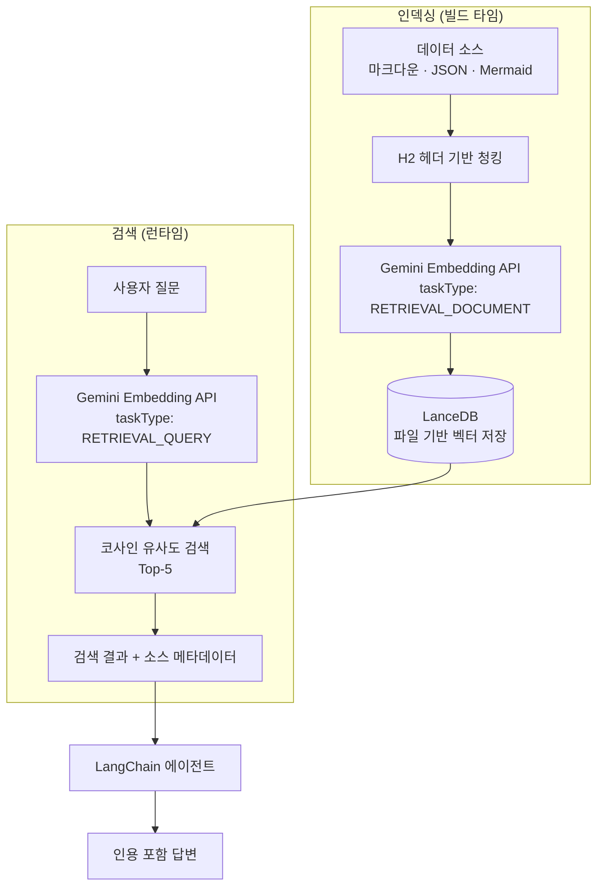
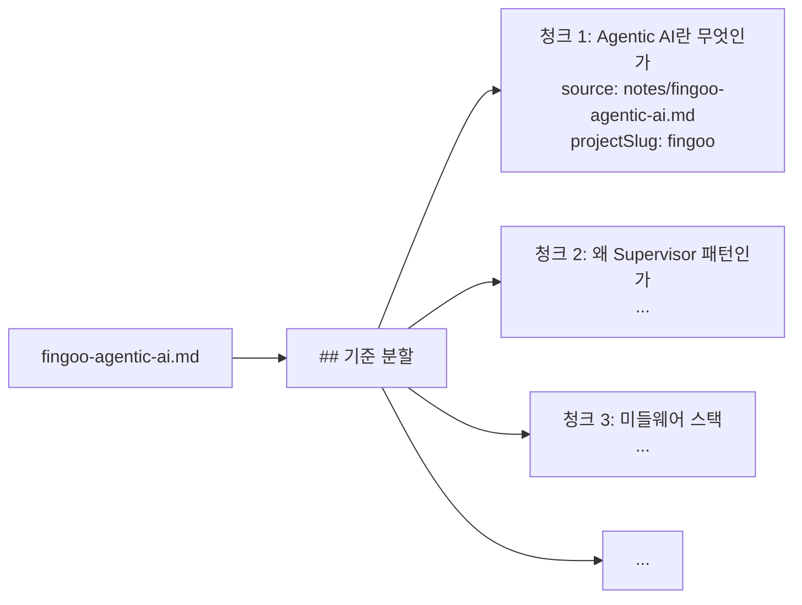
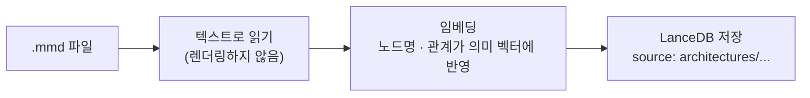

# LanceDB + Gemini Embedding RAG 파이프라인

포트폴리오 사이트의 AI 챗봇이 이력서·프로젝트·개발 노트 데이터를 기반으로 정확하게 답변하기 위한 RAG(Retrieval-Augmented Generation) 파이프라인을 설계하고 구현한 과정을 정리합니다.

## 문제 정의

"핀구에서 멀티 에이전트를 어떻게 설계했나요?"라는 질문에 LLM이 직접 답변하면 hallucination이 발생합니다. 학습 데이터에 없는 개인 프로젝트 정보이기 때문입니다. RAG로 실제 데이터를 검색하여 LLM에 주입해야 정확한 답변이 가능합니다.

하지만 이 프로젝트는 개인 포트폴리오 사이트입니다. pgvector를 위한 PostgreSQL 서버나 Pinecone 같은 클라우드 벡터 DB는 **오버엔지니어링**입니다.

## 왜 LanceDB인가

| 벡터 DB | 장점 | 이 프로젝트에 부적합한 이유 |
|---|---|---|
| pgvector | PostgreSQL 확장, SQL 쿼리 가능 | DB 서버 필요, 인프라 비용 발생 |
| Pinecone | 완전 관리형, 높은 가용성 | 무료 티어 제한, 개인 프로젝트에 과도한 비용 |
| Chroma | Python 생태계, 편리한 API | Node.js 서버와 언어 불일치 |
| **LanceDB** | **파일 기반, 서버 불필요, 임베디드** | — |

LanceDB를 선택한 결정적 이유는 **서버가 필요 없다**는 점입니다. SQLite처럼 파일 기반으로 동작하므로 별도 인프라 없이 애플리케이션에 임베딩됩니다.

```typescript
// 연결 = 파일 경로 지정뿐
import { connect } from "@lancedb/lancedb";

const db = await connect(join(import.meta.dir, "../../db"));
const table = await db.openTable("documents");
```

배포 시에도 `db/` 폴더만 함께 배포하면 됩니다. Railway 같은 PaaS에서 추가 데이터베이스 서비스 없이 바로 동작합니다.

## 전체 파이프라인



## 데이터 소스와 청킹 전략

### 데이터 소스

| 소스 | 파일 수 | 내용 |
|---|---|---|
| `about.md` | 1 | 자기소개 |
| `experience.md` | 1 | 경력 사항 (5개 포지션) |
| `education.md` | 1 | 학력 |
| `qna.json` | 1 (5쌍) | 자주 묻는 질문과 답변 |
| `projects/*.md` | 2 | 프로젝트 설명 |
| `notes/*.md` | 11 | 개발 노트 (핀구 8개 + 챗봇 3개) |
| `architectures/` | 다수 | Mermaid 다이어그램 (텍스트로 인덱싱) |

### H2 헤더 기반 청킹

마크다운 파일을 `## 제목` 단위로 분할합니다. 이 전략을 선택한 이유:

- **의미 단위 보존**: 고정 길이(500자)로 자르면 문맥이 끊김. H2 섹션은 하나의 완결된 개념 단위
- **검색 정확도**: "미들웨어 스택"을 검색하면 미들웨어 섹션 전체가 반환됨. 고정 길이면 섹션 중간에서 잘릴 수 있음
- **메타데이터 매핑**: 각 청크에 소스 파일과 프로젝트 slug를 저장하여 인용 시 정확한 페이지 링크 생성



## Gemini Embedding — taskType 분리

Gemini Embedding API의 핵심 기능은 `taskType`입니다. 인덱싱 시와 검색 시에 다른 taskType을 사용합니다.

```typescript
// 인덱싱 시: 문서를 벡터로 변환
const docEmbedding = await ai.models.embedContent({
  model: "gemini-embedding-001",
  contents: chunkText,
  config: { taskType: "RETRIEVAL_DOCUMENT" },
});

// 검색 시: 쿼리를 벡터로 변환
const queryEmbedding = await ai.models.embedContent({
  model: "gemini-embedding-001",
  contents: userQuery,
  config: { taskType: "RETRIEVAL_QUERY" },
});
```

| taskType | 용도 | 최적화 방향 |
|---|---|---|
| `RETRIEVAL_DOCUMENT` | 문서 임베딩 | 문서의 핵심 의미를 포착하도록 최적화 |
| `RETRIEVAL_QUERY` | 쿼리 임베딩 | 질문의 의도를 파악하도록 최적화 |

같은 모델이지만 taskType에 따라 벡터 공간에서의 매핑이 달라집니다. 이 비대칭 임베딩이 검색 정확도를 높이는 핵심입니다.

## 검색 구현

```typescript
export async function retrieve(
  query: string,
  topK = 5
): Promise<SearchResult[]> {
  // 1. 쿼리 임베딩
  const response = await ai.models.embedContent({
    model: "gemini-embedding-001",
    contents: query,
    config: { taskType: "RETRIEVAL_QUERY" },
  });
  const vector = response.embeddings![0].values!;

  // 2. LanceDB 코사인 유사도 검색
  const table = await getTable();
  const results = await table.search(vector).limit(topK).toArray();

  // 3. 결과 매핑
  return results.map((r) => ({
    text: r.text as string,
    source: r.source as string,
    projectSlug: (r.projectSlug as string) || "",
  }));
}
```

전체 검색 흐름이 **6줄**로 완결됩니다. LanceDB의 `search()` 메서드가 코사인 유사도 계산과 정렬을 내부에서 처리하기 때문입니다.

## 테이블 연결 — 싱글턴 패턴

```typescript
let table: Table | null = null;

export async function getTable(): Promise<Table> {
  if (!table) {
    const db = await connect(join(import.meta.dir, "../../db"));
    table = await db.openTable("documents");
  }
  return table;
}
```

LanceDB 연결을 싱글턴으로 관리합니다. 매 요청마다 파일을 열면 I/O 오버헤드가 발생하므로, 첫 요청에서만 연결하고 이후에는 캐시된 테이블을 재사용합니다.

## 트러블슈팅: Mermaid 다이어그램 인덱싱

### 문제

개발 노트에 포함된 Mermaid 다이어그램이 아키텍처를 설명하는 핵심 정보인데, 벡터 검색에서 누락되었습니다. "핀구 아키텍처를 설명해줘"라고 질문하면 Mermaid 코드 블록이 검색되지 않았습니다.

### 원인 분석

마크다운 파서가 코드 블록(` ```mermaid `)을 일반 텍스트와 다르게 처리하면서, Mermaid 다이어그램이 청킹 과정에서 빈 텍스트로 처리되거나 이전 섹션에 포함되지 않았습니다.

### 해결

`architectures/` 폴더에 Mermaid 다이어그램을 별도로 저장하고, 텍스트로 인덱싱합니다. Mermaid 문법 자체가 `Supervisor --> MarketData[시장데이터 에이전트]` 같은 관계를 텍스트로 표현하므로, 임베딩 모델이 의미를 잘 포착합니다.



**결과**: "아키텍처", "에이전트 구조", "파이프라인" 관련 질문에 Mermaid 다이어그램의 텍스트 설명이 검색 결과에 포함되어 AI가 구조를 정확히 설명할 수 있게 되었습니다.

## 핵심 인사이트

- **LanceDB = 개인 프로젝트의 최적해**: 서버 불필요, 파일 기반, 배포 시 폴더만 복사. pgvector나 Pinecone은 이 규모에서 오버엔지니어링
- **taskType 분리가 검색 품질을 결정**: 같은 Gemini 모델이라도 RETRIEVAL_DOCUMENT vs RETRIEVAL_QUERY로 비대칭 임베딩하면 정확도가 체감할 정도로 향상
- **H2 청킹 = 의미 단위 보존**: 고정 길이 청킹은 "미들웨어 스택" 섹션을 중간에서 자를 수 있음. H2 기반이면 완결된 개념 단위로 검색
- **Mermaid는 텍스트다**: 다이어그램을 렌더링하지 않고 텍스트로 인덱싱하면 `Supervisor --> MarketData` 같은 관계가 임베딩에 반영됨. 시각적 정보도 텍스트 검색 가능
- **싱글턴 연결의 실용성**: 파일 기반 DB라도 매 요청마다 열면 I/O 오버헤드. 싱글턴으로 캐시하면 검색 응답 시간이 안정적으로 유지
