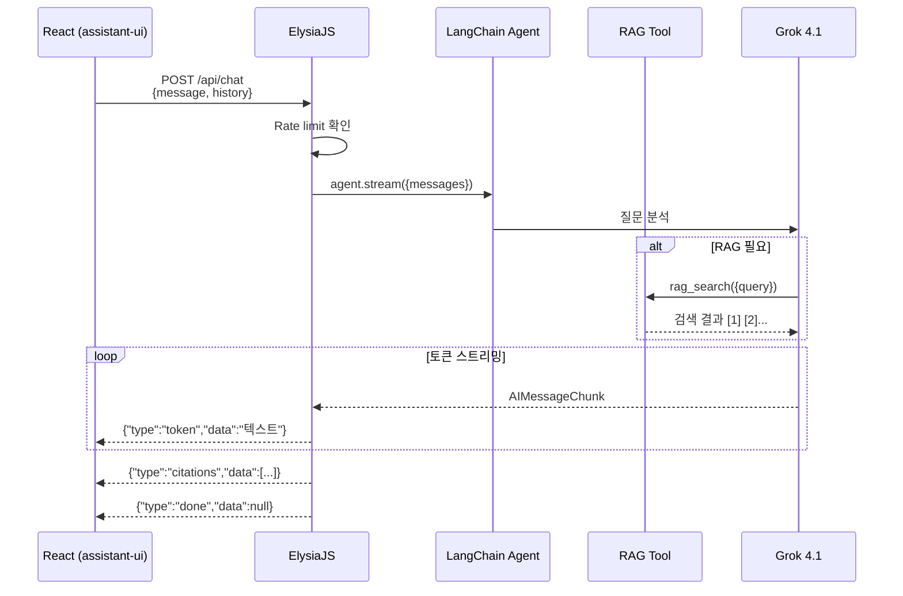
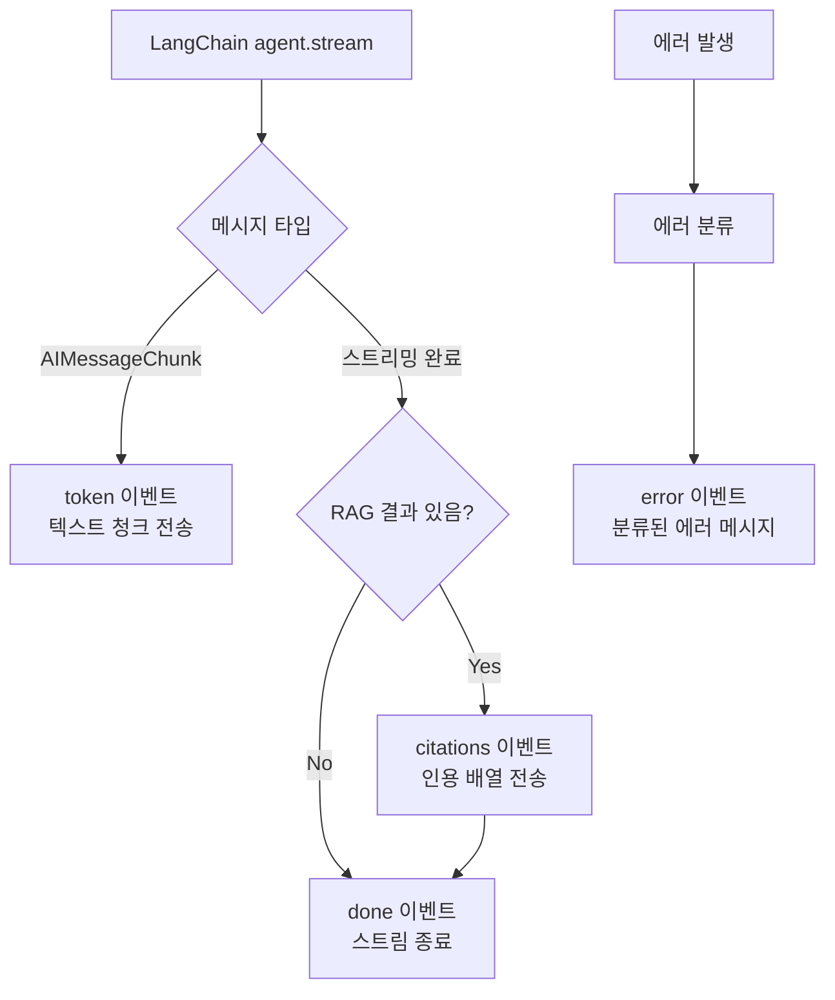
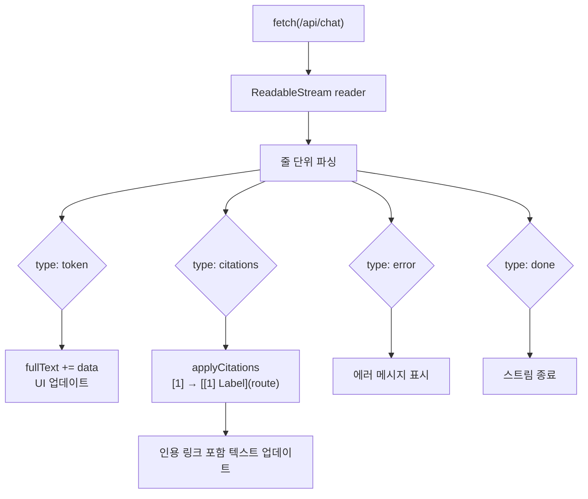
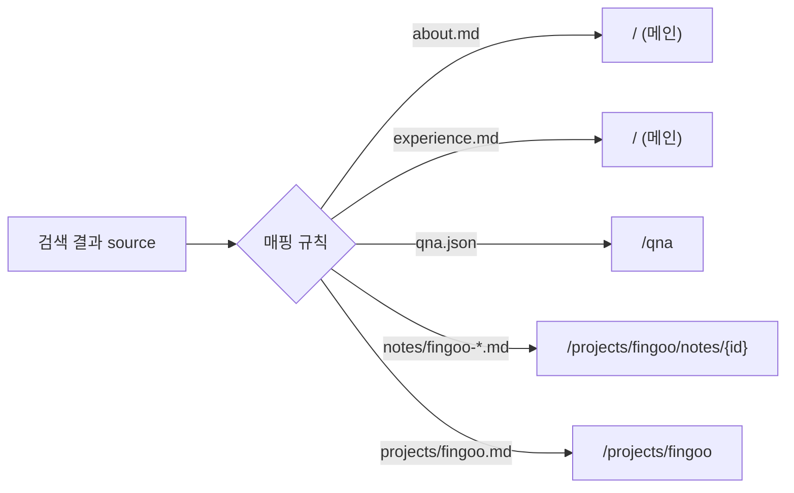
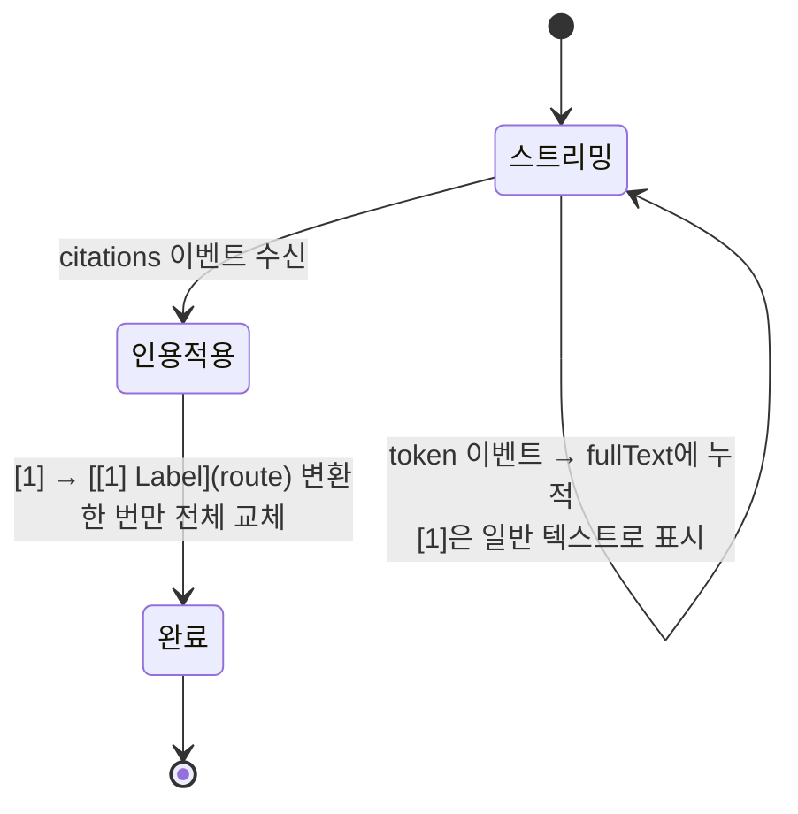

# ElysiaJS ReadableStream SSE 스트리밍과 인용 시스템

AI 챗봇의 응답을 토큰 단위로 실시간 스트리밍하고, 검색 결과를 내부 페이지 링크로 자동 변환하는 인용 시스템을 구현한 과정을 정리합니다.

## 문제 정의

LLM 응답은 수 초가 걸립니다. 전체 응답을 기다렸다가 한 번에 표시하면 사용자는 빈 화면을 보며 대기해야 합니다. ChatGPT처럼 토큰이 실시간으로 나타나는 스트리밍이 필수입니다.

추가로, RAG 검색 결과의 출처를 표시할 때 단순 텍스트가 아닌 **클릭 가능한 내부 링크**로 제공해야 합니다. "[1] Fingoo Agentic AI" 인용을 클릭하면 해당 개발 노트 페이지로 이동하는 경험이 목표입니다.

## 왜 SSE인가

| 방식 | 양방향 | 재연결 | 구현 복잡도 | 이 프로젝트에서 |
|---|---|---|---|---|
| WebSocket | O | 직접 구현 | 높음 | 과도 — 채팅은 요청-응답 패턴 |
| Socket.io | O | 자동 | 중간 | 과도 — 서버/클라이언트 라이브러리 필요 |
| **SSE (ReadableStream)** | X (단방향) | 브라우저 내장 | **낮음** | **적합** |
| Polling | X | 불필요 | 낮음 | 비효율 — 매번 HTTP 요청 |

이 챗봇은 **요청-응답 패턴**입니다. 사용자가 메시지를 보내면 서버가 스트리밍으로 응답하고 끝. 양방향 통신이 필요한 핀구(interrupt resume, 파일 업로드 동기화)와 달리, 여기서는 단방향 스트리밍이면 충분합니다.

SSE의 장점은 **HTTP 위에서 동작**한다는 점입니다. 별도 프로토콜 업그레이드 없이 일반 POST 요청의 응답을 스트리밍합니다. ElysiaJS에서는 `ReadableStream`을 반환하면 자동으로 chunked transfer encoding이 적용됩니다.

## 스트리밍 아키텍처



## Newline-Delimited JSON 포맷

SSE 표준(`text/event-stream`)이 아닌 **Newline-Delimited JSON** 포맷을 선택했습니다.

```
{"type":"token","data":"핀구의"}\n
{"type":"token","data":" Multi-Agent"}\n
{"type":"token","data":" 시스템은"}\n
{"type":"citations","data":[{"index":1,"text":"...","route":"/projects/fingoo/notes/fingoo-agentic-ai","label":"Fingoo Agentic AI"}]}\n
{"type":"done","data":null}\n
```

| 포맷 | 장점 | 단점 |
|---|---|---|
| SSE (`text/event-stream`) | 브라우저 EventSource API 지원 | POST 불가 (GET만), 인증 헤더 제한 |
| **NDJSON** | POST 가능, 헤더 자유, JSON 파싱 간단 | EventSource API 미사용, 직접 파싱 |

`EventSource`는 GET 요청만 지원하므로 요청 본문(`message`, `history`)을 전송할 수 없습니다. NDJSON은 일반 `fetch` + `ReadableStream` reader로 파싱하며, POST 요청과 커스텀 헤더를 자유롭게 사용할 수 있습니다.

## 서버: 4가지 이벤트 타입



```typescript
const readable = new ReadableStream({
  async start(controller) {
    try {
      clearLastSearchResults();
      const stream = await agent.stream({ messages }, { streamMode: "messages" });

      for await (const [msg] of stream) {
        if (msg instanceof AIMessageChunk && typeof msg.content === "string" && msg.content) {
          // 1. 토큰 이벤트 — 텍스트 청크
          controller.enqueue(encoder.encode(
            JSON.stringify({ type: "token", data: msg.content }) + "\n"
          ));
        }
      }

      // 2. 인용 이벤트 — RAG 결과가 있으면
      const searchResults = getLastSearchResults();
      if (searchResults.length > 0) {
        const citations = mapCitations(searchResults);
        controller.enqueue(encoder.encode(
          JSON.stringify({ type: "citations", data: citations }) + "\n"
        ));
      }

      // 3. 완료 이벤트
      controller.enqueue(encoder.encode(
        JSON.stringify({ type: "done", data: null }) + "\n"
      ));
    } catch (err) {
      // 4. 에러 이벤트 — 분류된 메시지
      const classified = classifyError(err);
      controller.enqueue(encoder.encode(
        JSON.stringify({ type: "error", code: classified.code, data: classified.message }) + "\n"
      ));
    } finally {
      clearLastSearchResults();
      controller.close();
    }
  },
});
```

## 클라이언트: 스트림 파싱과 인용 적용



```typescript
// 인용 적용 — [1] → 클릭 가능한 마크다운 링크
function applyCitations(text: string, citations: Citation[]): string {
  let result = text;
  for (const c of citations) {
    result = result.replaceAll(
      `[${c.index}]`,
      `[\\[${c.index}\\] ${c.label}](${c.route})`
    );
  }
  return result;
}
```

핵심: 인용 번호 `[1]`을 `[[1] Fingoo Agentic AI](/projects/fingoo/notes/fingoo-agentic-ai)` 형태의 마크다운 링크로 변환합니다. React Router의 클라이언트 사이드 라우팅과 결합되어, 인용을 클릭하면 **페이지 새로고침 없이** 해당 개발 노트로 이동합니다.

## 인용 시스템: 소스 → 라우트 자동 매핑

RAG 검색 결과의 소스 파일을 내부 페이지 라우트로 자동 변환합니다.



```typescript
const ROUTE_MAP: Record<string, string> = {
  "about.md": "/",
  "education.md": "/",
  "experience.md": "/",
  "qna.json": "/qna",
};

function getRoute(r: SearchResult): string {
  if (ROUTE_MAP[r.source]) return ROUTE_MAP[r.source];
  if (r.source.startsWith("notes/"))
    return `/projects/${r.projectSlug}/notes/${r.source.split("/").pop()?.replace(/\.md$/, "")}`;
  return `/projects/${r.source.replace(/^projects\//, "").replace(/\.md$/, "")}`;
}
```

이 매핑은 **새로운 개발 노트를 추가해도 코드 변경 없이 자동으로 라우트가 생성**됩니다. 파일 경로 패턴만 따르면 인용 링크가 올바르게 동작합니다.

## 에러 분류 시스템

LLM API 에러를 사용자 친화적 메시지로 변환합니다.

| 에러 코드 | 감지 패턴 | 사용자 메시지 | 원인 |
|---|---|---|---|
| `CREDITS_EXHAUSTED` | credits, spending limit | "AI 밥값이 떨어졌어요 🍚" | xAI API 크레딧 소진 |
| `API_RATE_LIMITED` | too many, rate limit, 429 | "숨 좀 고를게요..." | LLM API rate limit |
| `UNKNOWN` | 기타 모든 에러 | "알 수 없는 오류가 발생했어요" | 네트워크, 서버 등 |

사용자에게 기술적 에러 메시지 대신 **맥락에 맞는 한국어 메시지**를 보여줍니다. 에러 코드는 별도로 로깅하여 디버깅에 활용합니다.

## 트러블슈팅: 인용 적용 타이밍

### 문제

스트리밍 중에 인용 번호 `[1]`이 일반 텍스트로 먼저 표시되고, 스트리밍 완료 후에야 링크로 변환되면서 텍스트가 갑자기 바뀌는 깜빡임이 발생했습니다.

### 원인 분석

LangChain의 `streamMode: "messages"`는 토큰을 하나씩 전송합니다. RAG 도구 호출 결과(인용 정보)는 스트리밍이 완료된 후에야 최종 확정됩니다. 토큰 스트리밍 중에는 어떤 인용이 사용될지 모릅니다.

### 해결: 2단계 렌더링



인용 변환을 **스트리밍 완료 후 1회만** 실행합니다. `citations` 이벤트가 도착하면 `applyCitations()`로 전체 텍스트를 한 번에 업데이트합니다. 토큰 단위 변환이 아니라 전체 텍스트 교체이므로 깜빡임이 1회로 최소화됩니다.

## 핵심 인사이트

- **NDJSON > SSE 표준**: EventSource는 GET만 지원하여 요청 본문 전송 불가. `fetch` + NDJSON이면 POST, 커스텀 헤더, abort signal 모두 자유롭게 사용
- **인용 매핑의 자동화**: 소스 파일 경로 → 내부 라우트 변환을 규칙 기반으로 자동화하면, 새 노트 추가 시 코드 변경 없이 인용 링크가 동작
- **에러 분류 = UX 품질**: 기술적 에러 메시지를 사용자에게 그대로 노출하면 신뢰 하락. 패턴 매칭으로 분류하고 맥락에 맞는 한국어 메시지를 제공
- **2단계 렌더링으로 깜빡임 최소화**: 스트리밍 중에는 `[1]`을 텍스트로 두고, `citations` 이벤트 후 1회만 링크로 변환하면 UX가 자연스러움
- **ReadableStream의 단순함**: ElysiaJS에서 `new ReadableStream()`을 반환하면 chunked transfer가 자동 적용. 프레임워크 종속 SSE 라이브러리 불필요
