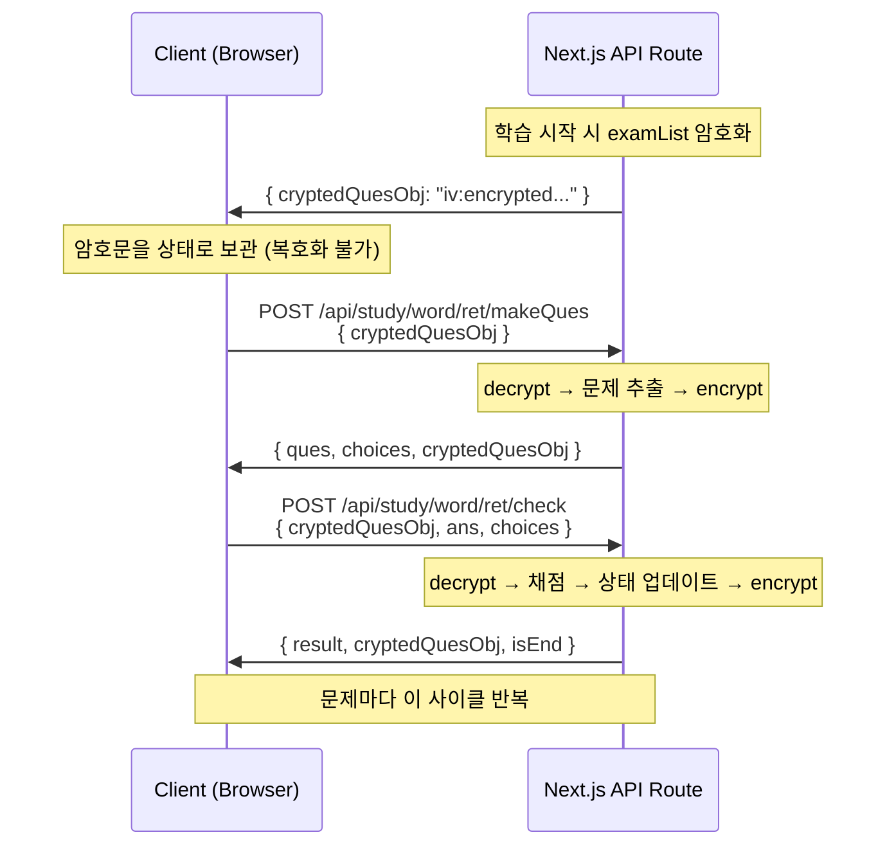

# 학습 데이터를 지키는 방법

학원용 영어 학습 앱에서 단어 데이터는 핵심 자산입니다. 학원이 직접 편집하고 배포하는 단어장, 시험 문제, 학습 진도 — 이것들이 브라우저 네트워크 탭에서 그대로 보인다면? 경쟁 학원이 API를 호출해서 전체 단어 DB를 긁어가는 건 시간 문제입니다. VocaTokTok에서 학습 데이터를 서버-사이드 암호화로 보호한 설계를 정리합니다.

## 왜 암호화가 필요한가

VocaTokTok의 학습 모드는 클라이언트와 서버 사이에서 단어 목록을 반복적으로 주고받습니다. 문제 출제(makeQues) → 정답 확인(check) → 다음 문제 출제 → … 이 사이클이 수십 회 반복됩니다. 암호화 없이는 다음 문제가 벌어집니다.

- **응답 가로채기**: 네트워크 탭에서 `examList`를 열면 영어-한글 매핑이 전부 노출. 시험 중에 답을 볼 수 있음
- **데이터 스크래핑**: API 엔드포인트를 직접 호출하면 학원이 구축한 전체 단어장을 추출 가능
- **상태 위변조**: 클라이언트가 `quesObj`(문제 진행 상태)를 조작하면 점수, 정답률, 학습 기록을 위조 가능

핵심은 **클라이언트를 신뢰하지 않는 설계**입니다. 학습 상태 객체를 서버에서 암호화해서 내려보내고, 클라이언트는 불투명한 문자열만 들고 있다가 다시 서버로 올려보냅니다.

## 암호화 설계



암호화 대상은 `WordQuesObj` — 전체 시험 단어 목록(`examAllList`, `examList`), 현재 문제 번호(`quesNum`), 정답/오답 수, 점수, 오답 목록, 학습 로그를 담은 객체입니다. 이 객체 전체를 JSON 직렬화한 뒤 AES-256-CBC로 암호화합니다. 클라이언트에게는 문제 텍스트(`ques`)와 선택지(`choices`)만 평문으로 내려가고, 나머지는 전부 암호문입니다.

## 구현

### AES-256-CBC 암호화 모듈

```typescript
// modules/server/objCrypto.ts
import crypto from "crypto";

const ENCRYPTION_KEY = Buffer.from(process.env.CRYPTO_SECRET || "", "hex"); // 32 bytes
const IV_LENGTH = 16; // AES block size

export const encrypt = (text: string) => {
  const iv = crypto.randomBytes(IV_LENGTH);
  const cipher = crypto.createCipheriv("aes-256-cbc", Buffer.from(ENCRYPTION_KEY), iv);
  let encrypted = cipher.update(text, "utf8", "hex");
  encrypted += cipher.final("hex");
  return iv.toString("hex") + ":" + encrypted;
};

export const decrypt = (text: string) => {
  const textParts = text.split(":");
  const iv = Buffer.from(textParts.shift() || "", "hex");
  const encryptedText = textParts.join(":");
  const decipher = crypto.createDecipheriv("aes-256-cbc", Buffer.from(ENCRYPTION_KEY), iv);
  let decrypted = decipher.update(encryptedText, "hex", "utf8");
  decrypted += decipher.final("utf8");
  return decrypted;
};
```

설계 포인트:

| 항목 | 선택 | 이유 |
|---|---|---|
| 알고리즘 | AES-256-CBC | Node.js 내장 `crypto` 모듈 지원, 충분한 보안 강도 |
| 키 길이 | 256-bit (32 bytes) | 환경변수에서 hex 문자열로 관리 |
| IV (초기화 벡터) | 매 암호화마다 `crypto.randomBytes(16)` | 같은 평문이라도 매번 다른 암호문 생성 |
| 포맷 | `iv_hex:encrypted_hex` | IV를 암호문 앞에 붙여서 복호화 시 분리 |

### 학습 플로우에서의 적용

**1단계: 학습 객체 생성 시 암호화**

클라이언트에서 학습을 시작하면, 단어 목록을 `/api/crypto/encrypt`로 보내 암호화합니다. 이후 단어 원본은 클라이언트 메모리에서 사라지고, 암호문만 `zustand` 스토어에 저장됩니다.

```typescript
// 학습 시작 시 — consts.ts
const wordsCryptRes = await axios.post("/api/crypto/encrypt", {
  text: JSON.stringify(examAllList),
});
const examListCryptRes = await axios.post("/api/crypto/encrypt", {
  text: JSON.stringify(examList),
});

return {
  examAllList: wordsCryptRes.data.crypted as string,  // 암호문
  examList: examListCryptRes.data.crypted as string,   // 암호문
  // ...
};
```

**2단계: 문제 출제 시 복호화 → 재암호화**

`/api/study/word/ret/makeQues` 라우트에서 암호문을 복호화하고, 현재 문제와 선택지를 추출한 뒤, 상태 객체를 다시 암호화해서 내려보냅니다.

```typescript
// API route: makeQues
const decryptedQuesObj = decrypt(cryptedQuesObj);
const quesObj: WordQuesObj = JSON.parse(decryptedQuesObj);

const ques = quesObj.examList[quesObj.quesNum];
const choices = shuffleArray(/* 보기 생성 로직 */);

const crypted = encrypt(JSON.stringify(quesObj));  // 재암호화

return { ques: { no: ques.no, text: quesTxt }, choices, cryptedQuesObj: crypted };
```

**3단계: 채점 시에도 동일 패턴**

`/api/study/word/ret/check`에서도 복호화 → 채점 → 점수/오답 업데이트 → 재암호화 → 응답. 클라이언트는 정답 여부(`result`)와 새 암호문만 받습니다.

### IV가 매번 바뀌는 이유

같은 학습 객체를 반복적으로 암호화/복호화하기 때문에, 고정 IV를 쓰면 패턴 분석이 가능합니다. `crypto.randomBytes(16)`으로 매 암호화마다 새 IV를 생성하므로, 같은 `quesObj`라도 매번 다른 암호문이 됩니다.

## 성능과 보안 트레이드오프

### 오버헤드

AES-256-CBC는 Node.js의 OpenSSL 바인딩을 사용하므로 순수 JavaScript보다 빠릅니다. 학습 객체의 크기는 보통 수 KB~수십 KB이므로 암호화/복호화에 걸리는 시간은 1ms 미만입니다. 학습 중 매 문제마다 encrypt/decrypt가 한 번씩 일어나지만, DB 쿼리 대비 무시할 수 있는 수준입니다.

### 키 관리

- 암호화 키는 환경변수(`CRYPTO_SECRET`)로 관리하며 코드에 하드코딩하지 않음
- 서버 사이드 전용 모듈(`modules/server/`)에 위치하여 클라이언트 번들에 포함되지 않음
- Next.js의 서버 컴포넌트/API 라우트에서만 import 가능

### 한계

- **서버 사이드 전용**: 암호화/복호화가 모두 서버에서 일어남. 클라이언트는 암호문을 전달만 할 뿐, 복호화 키를 모름
- **키 로테이션 미지원**: 현재는 단일 키를 사용. 키를 교체하면 진행 중인 학습 세션의 암호문이 복호화 불가
- **인증과의 결합**: 모든 API 라우트가 JWT 토큰 검증(`verifyAndRefreshTokens`)을 먼저 수행하므로, 암호화는 2차 방어선. 인증 없이는 API 호출 자체가 차단됨

## 배운 점

- **클라이언트를 신뢰하지 마라**: 학습 상태를 클라이언트에 평문으로 두면 위변조가 가능. 서버에서 암호화한 불투명 토큰으로 다루면 클라이언트는 운반만 할 뿐 조작 불가
- **매 요청마다 재암호화하는 패턴**: 상태가 변경될 때마다 decrypt → update → encrypt 사이클을 돌림. IV가 매번 바뀌므로 동일 상태라도 암호문이 달라져 패턴 분석 방지
- **Node.js 내장 crypto면 충분**: 외부 라이브러리 없이 `crypto.createCipheriv`만으로 AES-256-CBC 구현 가능. 학습 데이터 규모에서는 성능 이슈 없음
- **암호화는 방어의 한 층일 뿐**: JWT 인증 + HTTPS + 서버 사이드 암호화를 조합해야 실효성 있음. 암호화 단독으로는 키 유출 시 무력화됨
