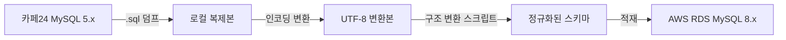

# 카페24에서 AWS로 — DB 마이그레이션 여정

VocaTokTok의 DB는 카페24 호스팅의 MySQL 5.x에서 10년 넘게 운영되고 있었다. 인코딩은 EUC-KR, 테이블 구조는 정규화되지 않은 상태. Next.js로 전면 리빌드하면서 DB도 AWS RDS(MySQL 8.x)로 옮기기로 했다. 단순한 덤프 → 복원이 아니라, 인코딩 전환과 테이블 구조 정규화를 동시에 해야 하는 작업이었다.

## 왜 옮겨야 했나

문제는 여러 겹이었다.

**MySQL 5.x의 한계.** 8.x에서는 지원되는 쿼리 문법이 5.x에서는 동작하지 않는 경우가 있었다. 복잡한 집계를 하려면 서브쿼리를 중첩하거나 애플리케이션 단에서 처리해야 했다.

**EUC-KR 인코딩.** 테이블 캐릭터셋과 커넥션 charset 모두 `euckr`이었다. 현대 프레임워크와 라이브러리는 UTF-8을 기본으로 가정하기 때문에, Prisma를 연결하는 것부터 문제가 될 수 있었다.

**테이블 구조의 문제.** 가장 큰 골칫거리는 테이블 네이밍이었다. 유저 테이블이 학원별로 분리되어 있었다 — `user_A001`, `user_B002` 식으로 **테이블명에 학원 코드가 붙는** 패턴이었다. 명확한 전략 없이 운영하면서 굳어진 구조였고, 이런 패턴이 여러 테이블에 걸쳐 있었다.

이 구조 때문에 데이터 정합성이 깨지기 쉬웠다. 학원 전체 학생을 조회하려면 동적으로 테이블명을 조합해야 하고, 새 학원이 추가되면 테이블을 수동으로 만들어야 했다. ORM으로 전환하면 이런 동적 테이블 접근이 불가능하다. **구조를 먼저 정규화하지 않으면 마이그레이션 자체가 불가능**했다.

## 마이그레이션 파이프라인

한 번에 옮기는 게 아니라 단계별로 파이프라인을 구성했다.

**1단계: 덤프.** 기존 DB를 `.sql`로 내렸다.

**2단계: 인코딩 변환.** EUC-KR로 인코딩된 문자열을 UTF-8로 변환했다. 여기서 세 가지 함정이 있었다.

**3단계: 구조 변환.** 학원별로 분리된 테이블들을 하나의 정규화된 테이블로 합치는 스크립트를 작성했다. `user_A001`, `user_B002`의 데이터를 `user` 테이블에 `academy_code` 컬럼을 추가하여 통합했다. 이런 변환이 여러 테이블에 걸쳐 필요했다.

**4단계: 적재.** 변환된 데이터를 AWS RDS MySQL 8.x에 넣었다.

| 항목 | Before | After |
|---|---|---|
| 호스팅 | 카페24 | AWS RDS |
| MySQL 버전 | 5.x | 8.x |
| 캐릭터셋 | euckr | utf8mb4 |
| 콜레이션 | euckr_korean_ci | utf8mb4_unicode_ci |
| 테이블 구조 | 학원별 분리 (동적 테이블명) | 정규화 (academy_code 컬럼) |

## 인코딩 변환의 세 가지 함정

단순히 캐릭터셋 설정만 바꾸면 끝날 것 같지만, 10년치 데이터는 그렇게 단순하지 않았다.

**이중 인코딩.** EUC-KR 바이트가 UTF-8로 **다시 인코딩**된 데이터가 있었다. DB에는 정상적인 UTF-8처럼 보이지만, 실제로는 EUC-KR 바이트를 한 번 더 감싼 것이다. 화면에 표시하면 깨진 한글이 나온다. 바이트 패턴을 분석해서 이중 인코딩된 데이터를 감지하고 역변환했다.

**CP949와 EUC-KR의 혼재.** CP949는 EUC-KR의 확장 인코딩으로, EUC-KR에 없는 한글을 추가로 포함한다. 10년간 쌓인 데이터에 두 인코딩이 섞여 있었다. EUC-KR로 디코딩하면 일부 글자가 깨지고, CP949로 디코딩하면 괜찮은 데이터가 있었다. 디코딩 실패 시 CP949로 폴백하는 체인을 만들었다.

**런타임 파일 업로드.** DB 전환은 한 번이면 끝나지만, **학원에서 올리는 파일은 계속 EUC-KR로 올라온다.** 선생님이 엑셀로 단어 목록을 만들어 업로드하는데, 한국의 엑셀은 CSV를 EUC-KR로 저장하는 경우가 많다. 파일 업로드 시 바이트 패턴으로 인코딩을 자동 감지하고, UTF-8이 아니면 변환하는 로직을 추가했다.

## 돌이켜보면

이 마이그레이션은 단순한 호스팅 이전이 아니었다. 인코딩 전환, 테이블 구조 정규화, MySQL 버전 업그레이드를 동시에 처리해야 했다. 중간 변환 스크립트를 두고 단계별로 파이프라인을 구성한 것이 핵심이었다. 한 번에 모든 걸 바꾸려 했으면 어디서 문제가 생겼는지 추적할 수 없었을 것이다. DB 전환은 일회성이지만, 런타임 인코딩 처리는 서비스가 운영되는 한 계속 필요하다.
