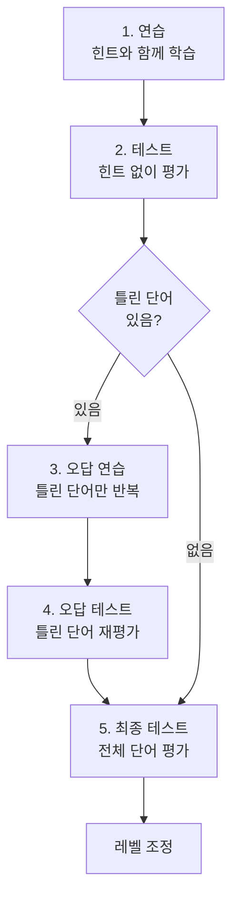

# 학습 알고리즘을 코드로 옮기다

VocaTokTok의 학습 알고리즘은 원장님이 오랜 운영 경험을 바탕으로 설계하고 특허를 받은 것이다. 알고리즘 자체는 단순하다. 정답/오답 횟수로 아는 단어와 모르는 단어를 판별하고, 모르는 단어만 반복시킨다. 문제는 이 알고리즘을 DB 연동, 비즈니스 로직, UX까지 일관된 흐름으로 구현하는 것이었다. 그리고 쌓인 학습 데이터를 선생님의 코칭에 실제로 도움이 되는 형태로 정제하여 보여주는 것이 핵심 과제였다.

## 두 가지 학습 모드

VocaTokTok에는 두 가지 학습 모드가 있다.

| 모드 | 방식 | 측정 능력 |
|---|---|---|
| RET | 영어를 보고 뜻을 고르는 객관식 | 인식 (recognition) |
| RDT | 뜻을 보고 영어를 직접 쓰는 주관식 | 회상 (recall) |

영어를 보고 뜻을 아는 것(인식)과, 뜻을 보고 영어를 떠올리는 것(회상)은 다른 능력이다. 같은 단어라도 RET에서는 맞추지만 RDT에서는 틀리는 경우가 흔하다. 두 모드를 분리해서 각각의 이해도를 독립적으로 추적한다.

## 아는 단어인지 모르는 단어인지

판별 기준은 단순하다. **정답 횟수 - 오답 횟수**가 임계값을 넘으면 "안다"로 분류한다.

RET(객관식)는 찍을 수 있으니 임계값이 더 높다. RDT(주관식)는 직접 써야 하니 임계값이 낮아도 신뢰할 수 있다. 이 임계값은 레벨에 따라 달라진다. 레벨이 올라갈수록 더 많이 맞춰야 "안다"로 인정된다. 이 경계값들은 오랜 서비스 운영을 통해 축적된 경험 기반으로 설정된 것이다.

## 5단계 학습 루프

하나의 학습 세션은 5단계로 구성된다.

핵심은 **틀린 단어만 골라서 반복**하는 3~4단계다. 50개 단어 중 5개를 틀렸으면, 그 5개만 다시 연습하고 다시 테스트한다. 이미 아는 45개를 다시 풀게 하지 않는다.

## 연습 단계에서 힌트가 점점 사라진다

연습 단계는 힌트를 줬다가 점차 빼는 방식이다.

RET(객관식)에서는 처음에 영어+한글을 모두 보여주고, 다음에 영어만, 그 다음에 한글만 보여준다. RDT(주관식)에서는 처음에 답을 전부 보여주고, 다음에 반을 가리고, 마지막에 전부 가린다. **scaffold → fade** 패턴이다.

한 번에 답을 가려버리면 학습 효과가 떨어진다. 단계적으로 힌트를 줄여나가는 것이 기억 정착에 효과적이다.

## 레벨은 자동으로 조정된다

최종 테스트 결과에 따라 레벨이 올라가거나 내려간다. 레벨은 1~9까지 있고, 각 레벨에 3개의 스텝이 있다. 테스트를 잘 보면 스텝이 올라가고, 스텝이 최대치를 넘으면 레벨이 올라간다. 반대로 오답률이 높으면 레벨이 내려간다.

레벨이 올라가면 **같은 단어를 더 많이 반복해야 "안다"로 인정**된다. 쉬운 레벨에서는 2번 맞추면 통과하지만, 높은 레벨에서는 5번 이상 맞춰야 한다. 레벨이 올라갈수록 확실히 아는 단어만 통과시키는 구조다.

## 데이터를 코칭에 쓸 수 있게 만들다

알고리즘이 돌아가면 학습 데이터가 쌓인다. 하지만 이 데이터를 그냥 선생님에게 보여주는 건 의미가 없다. 정답률 78%라는 숫자만으로는 이 학생을 어떻게 코칭해야 하는지 알 수 없다.

학습 데이터를 기반으로 **코칭에 도움이 되는 보조 통계 지표**를 만들었다. 학생이 어떤 유형의 단어에서 반복적으로 틀리는지, RET은 잘하는데 RDT에서 약한지, 레벨 변동 추이가 어떤지 — 선생님이 학생의 성취도를 더 빠르게 파악할 수 있는 지표들이다.

핵심은 **원시 데이터를 그대로 나열하지 않는 것**이었다. 선생님이 30명 학생을 관리하면서 각 학생의 raw 데이터를 분석할 시간은 없다. 코칭에 필요한 정보만 정제해서, 한눈에 파악할 수 있는 UI로 보여주는 것이 주요 과제였다.

## 돌이켜보면

알고리즘 자체는 단순했다. 정답 - 오답이 임계값을 넘으면 "안다", 아니면 "모른다". 진짜 어려웠던 건 이 알고리즘을 DB 스키마, 학습 세션 상태 관리, 모드별 분기 로직, UI 흐름까지 일관되게 엮는 것이었다. 그리고 쌓인 데이터를 선생님의 코칭 도구로 만드는 것 — **데이터가 있는 것과 데이터가 쓸모 있는 것은 다른 문제**였다.
