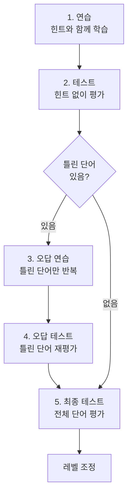

# 아는 단어와 모르는 단어를 어떻게 판별하는가

같은 교재로 같은 진도를 나가도, 학생마다 아는 단어와 모르는 단어는 다르다. 어떤 학생은 "abandon"을 이미 알고, 어떤 학생은 아직 모른다. 선생님이 30명 학생의 이해도를 일일이 파악하기란 불가능하다. 정답/오답 횟수를 기반으로 아는 단어와 모르는 단어를 자동 판별하고, 모르는 단어만 골라 반복 학습시키는 적응형 학습 알고리즘을 정리한다.

## 두 가지 학습 모드

VocaTokTok에는 두 가지 학습 모드가 있다.

| 모드 | 방식 | 측정 능력 |
|---|---|---|
| RET | 영어를 보고 뜻을 고르는 객관식 | 인식 (recognition) |
| RDT | 뜻을 보고 영어를 직접 쓰는 주관식 | 회상 (recall) |

영어를 보고 뜻을 아는 것(인식)과, 뜻을 보고 영어를 떠올리는 것(회상)은 다른 능력이다. 같은 단어라도 RET에서는 맞추지만 RDT에서는 틀리는 경우가 흔하다. 두 모드를 분리해서 각각의 이해도를 독립적으로 추적한다.

## 아는 단어인지 모르는 단어인지

판별 기준은 단순하다. **정답 횟수 - 오답 횟수**가 임계값을 넘으면 "안다"로 분류한다.

RET(객관식)는 찍을 수 있으니 임계값이 더 높다. RDT(주관식)는 직접 써야 하니 임계값이 낮아도 신뢰할 수 있다. 이 임계값은 레벨에 따라 달라진다. 레벨이 올라갈수록 더 많이 맞춰야 "안다"로 인정된다.

## 5단계 학습 루프

하나의 학습 세션은 5단계로 구성된다.

핵심은 **틀린 단어만 골라서 반복**하는 3~4단계다. 50개 단어 중 5개를 틀렸으면, 그 5개만 다시 연습하고 다시 테스트한다. 이미 아는 45개를 다시 풀게 하지 않는다.

## 연습 단계에서 힌트가 점점 사라진다

연습 단계는 힌트를 줬다가 점차 빼는 방식이다.

RET(객관식)에서는 처음에 영어+한글을 모두 보여주고, 다음에 영어만, 그 다음에 한글만 보여준다. RDT(주관식)에서는 처음에 답을 전부 보여주고, 다음에 반을 가리고, 마지막에 전부 가린다. **scaffold → fade** 패턴이다.

한 번에 답을 가려버리면 학습 효과가 떨어진다. 단계적으로 힌트를 줄여나가는 것이 기억 정착에 효과적이다.

## 레벨은 자동으로 조정된다

최종 테스트 결과에 따라 레벨이 올라가거나 내려간다. 레벨은 1~9까지 있고, 각 레벨에 3개의 스텝이 있다. 테스트를 잘 보면 스텝이 올라가고, 스텝이 최대치를 넘으면 레벨이 올라간다. 반대로 오답률이 높으면 레벨이 내려간다.

레벨이 올라가면 **같은 단어를 더 많이 반복해야 "안다"로 인정**된다. 쉬운 레벨에서는 2번 맞추면 통과하지만, 높은 레벨에서는 5번 이상 맞춰야 한다. 레벨이 올라갈수록 확실히 아는 단어만 통과시키는 구조다.

## 돌이켜보면

학습 알고리즘의 핵심은 **"모르는 것만 반복한다"**는 것이다. 아는 단어는 건너뛰고, 모르는 단어만 골라서 연습 → 테스트 → 재연습 루프를 돌린다. 레벨 시스템이 난이도를 자동 조절해서, 학생마다 자기 수준에 맞는 학습이 이루어진다. 선생님이 일일이 파악하지 않아도 시스템이 이해도를 추적한다.
