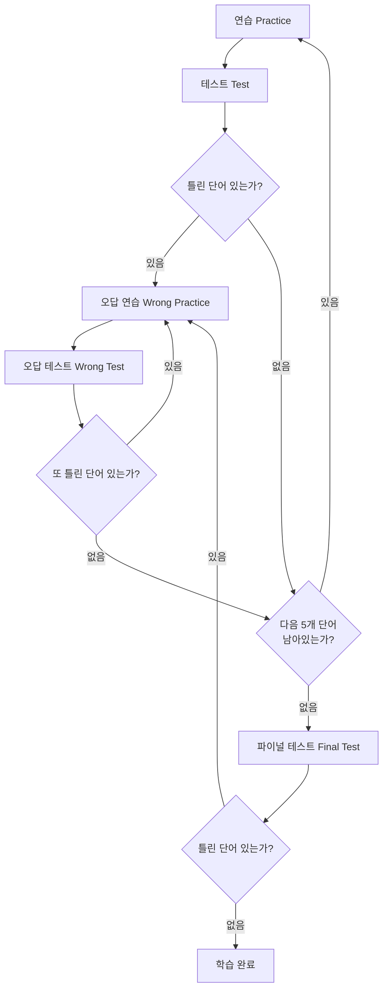
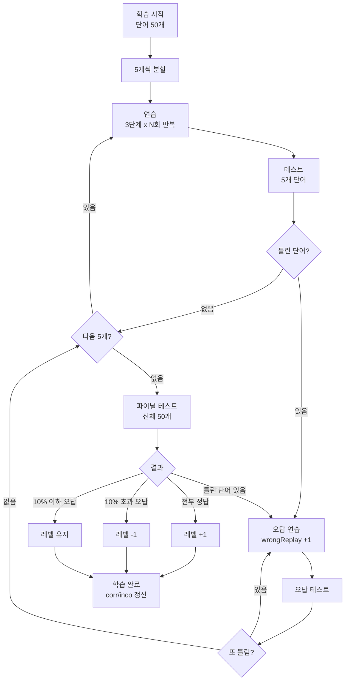

# 아는 단어와 모르는 단어를 어떻게 판별하는가

같은 교재로 같은 진도를 나가도, 학생마다 아는 단어와 모르는 단어는 다릅니다. 어떤 학생은 "abandon"을 이미 알고, 어떤 학생은 아직 모릅니다. 선생님이 30명 학생의 이해도를 일일이 파악하기란 불가능합니다. VocaTokTok은 정답/오답 횟수를 기반으로 아는 단어와 모르는 단어를 자동 판별하고, 모르는 단어만 골라 반복 학습시키는 적응형 학습 알고리즘을 구현했습니다.

## 아는/모르는 단어 판별 기준

VocaTokTok에는 두 가지 학습 모드가 있습니다.

- **RET (Reading English Test)**: 영어를 보고 뜻을 고르는 객관식 — 인식(recognition) 테스트
- **RDT (Reading Dictation Test)**: 뜻을 보고 영어를 직접 쓰는 주관식 — 회상(recall) 테스트

각 단어마다 `corr`(정답 횟수)과 `inco`(오답 횟수)를 누적하고, 그 차이가 임계값을 넘으면 "아는 단어"로 판정합니다.

```typescript
export const knowCriteria = {
  RET: 3,   // corr - inco >= 3 → 아는 단어
  RDT: 2,   // corr - inco >= 2 → 아는 단어
};
```

RET는 객관식이라 찍을 확률이 있으므로 임계값이 더 높고, RDT는 직접 쓰기라 2회 차이면 충분합니다. 반대로 `corr - inco`가 임계값 아래로 떨어지면 다시 "모르는 단어"로 복귀합니다. 단순 정답률이 아닌 **순수 정답 우위**를 기준으로 하기 때문에, 한 번 맞더라도 이후 틀리면 다시 모르는 단어로 돌아갑니다.

## 학습 루프 설계

학습의 핵심은 5단계 반복 루프입니다. 5개 단어 단위로 연습과 테스트를 반복하고, 모든 단어를 소화하면 전체 범위 파이널 테스트로 마무리합니다.



핵심 규칙:
- 5개 단어씩 잘라서 연습 + 테스트를 진행합니다
- 틀린 단어가 나오면 오답 연습 → 오답 테스트 루프를 통과할 때까지 반복합니다
- 모든 5개 묶음을 소화한 후 전체 단어 파이널 테스트를 치릅니다
- 파이널 테스트에서도 틀리면 다시 오답 루프로 돌아갑니다

## 연습 단계 프로그레션 — 힌트 점진적 제거

연습 단계에서는 힌트를 점차 줄여가며 난이도를 올립니다. RET와 RDT의 힌트 방식이 다릅니다.

**RET 연습** — 보여주는 정보를 점진적으로 줄임:
1. `both`: 영어 + 한국어 뜻 함께 표시 (완전 힌트)
2. `eng`: 영어만 표시 (뜻 숨김)
3. `kor`: 한국어 뜻만 표시 (영어 숨김)

**RDT 연습** — 영어 스펠링을 점진적으로 가림:
1. `none`: 영어 전체 표시 → 보고 따라쓰기
2. `half`: 영어의 절반을 `□`로 마스킹 → 추론하며 쓰기
3. `all`: 영어 전체를 `□`로 마스킹 → 완전히 외워서 쓰기

```typescript
// RDT 연습 단계 순환
const pracStepSequence: Record<RdtPracStepKey, RdtPracStepKey> = {
  none: "half",   // 전체보기 → 반만 가리기
  half: "all",    // 반만 가리기 → 전체 가리기
  all: "none",    // 다음 단어로
};
```

## 반복 횟수 공식

연습에서 각 단계를 몇 번 반복할지는 공식으로 결정됩니다.

```
반복 횟수 = autostudy_rdlv + wrongReplay
```

- `autostudy_rdlv` (또는 `autostudy_relv`): 사용자의 현재 학습 레벨 (기본 1)
- `wrongReplay`: 해당 테스트에서 오답 루프를 돌며 누적된 횟수

레벨이 높을수록, 오답을 반복할수록 연습 횟수가 늘어납니다. 한 번 틀릴 때마다 `wrongReplay`가 1 증가하므로, 계속 틀리는 단어는 점점 더 많이 연습하게 됩니다.

총 연습 클릭 수는 다음과 같습니다:

```typescript
const maxClick = examCount * (autostudy_rdlv + status.wrongReplay) * 3;
// 단어수 x 반복횟수 x 3단계(none/half/all 또는 both/eng/kor)
```

## 레벨 시스템 — 자동 난이도 조절

파이널 테스트 결과에 따라 학습 레벨이 자동으로 조절됩니다.

```typescript
const handleChangeLevel = async (wrongList: WordBasic[]) => {
  if (wrongList.length === 0) {
    // 전부 맞춤 → 레벨 +1
    fetcher.levelChange(userNo, 1);
  } else if (wrongList.length / examCount > 0.1) {
    // 10% 초과 오답 → 레벨 -1
    fetcher.levelChange(userNo, -1);
  }
  // 10% 이하 오답 → 레벨 유지
};
```

| 조건 | 레벨 변화 |
|---|---|
| 파이널 테스트 전부 정답 | +1 (난이도 상승) |
| 오답률 10% 초과 | -1 (난이도 하락) |
| 오답률 10% 이하 | 유지 |

레벨이 올라가면 반복 횟수가 늘어나 더 꼼꼼하게 학습하고, 레벨이 내려가면 반복 횟수가 줄어 부담을 낮춥니다. RET와 RDT 각각 독립적인 레벨(`autostudy_relv`, `autostudy_rdlv`)을 관리하므로, "객관식은 잘 맞추지만 쓰기는 어려운" 학생에게도 모드별 맞춤 난이도가 적용됩니다.

## 전체 학습 흐름



## 핵심 인사이트

- **corr - inco 순수 정답 우위 방식**: 단순 정답률이 아닌 "맞은 횟수 - 틀린 횟수"로 판별하므로, 한 번 맞더라도 나중에 틀리면 다시 모르는 단어로 복귀. 일시적 기억과 확실한 암기를 구별
- **RET/RDT 이중 임계값**: 객관식(찍기 가능)은 3, 주관식(직접 쓰기)은 2로 차등 적용. 테스트 형식의 난이도 차이를 반영
- **오답 루프의 자기 강화**: `wrongReplay`가 누적되면 반복 횟수가 늘어나, 어려운 단어일수록 더 많이 연습. 쉬운 단어는 빠르게 통과
- **레벨 자동 조절로 학생별 맞춤**: 선생님이 개입하지 않아도 학생의 실력에 맞게 난이도가 자동 조절. 30명 학생이 각자 다른 난이도로 학습
