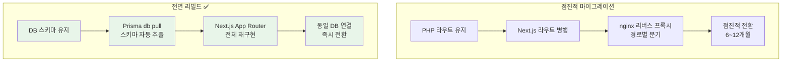
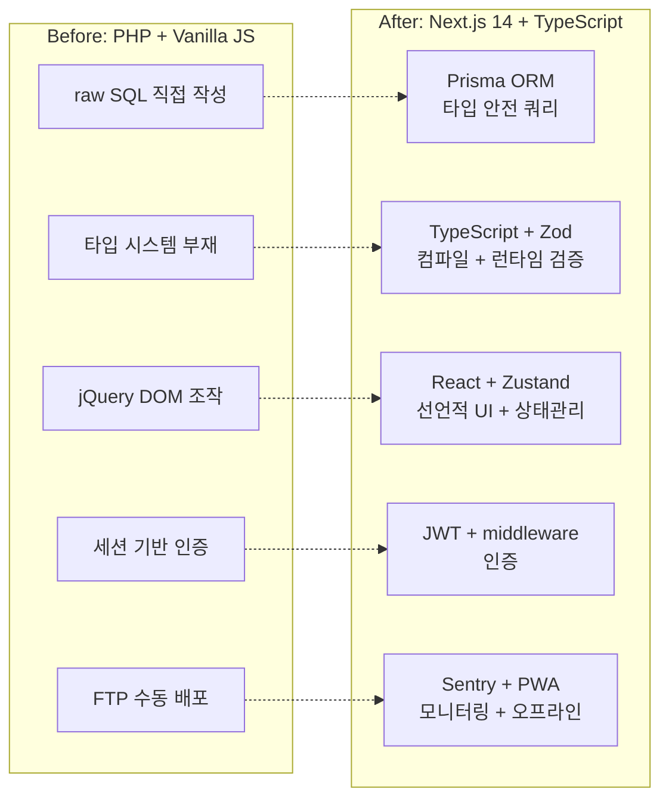

# PHP에서 Next.js로, 레거시를 버리는 용기

VocaTokTok은 10년 넘게 운영된 PHP + Vanilla JS 기반의 영어 학습 플랫폼입니다. jQuery로 DOM을 직접 조작하고, SQL 쿼리가 뷰 파일에 섞여 있고, 타입 시스템은 존재하지 않습니다. 기능 하나를 추가하려면 3개 파일을 열어서 문맥을 파악해야 하고, 리팩터링은 엄두도 못 냅니다. 이 글은 이 레거시를 Next.js 14 + TypeScript + Prisma 스택으로 전면 리빌드한 과정을 정리합니다.

## 왜 전면 리빌드인가

레거시 마이그레이션에는 두 가지 전략이 있습니다. 점진적 마이그레이션(Strangler Fig)과 전면 리빌드(Big Bang). 일반적으로는 점진적 마이그레이션이 안전하다고 알려져 있지만, VocaTokTok의 상황은 달랐습니다.



전면 리빌드를 선택한 이유는 세 가지입니다.

1. **PHP 코드에 재사용할 가치가 없음**: 비즈니스 로직이 뷰와 완전히 결합되어 있어서 추출이 불가능합니다. 점진적 마이그레이션을 하더라도 결국 모든 코드를 다시 작성해야 합니다.
2. **DB 스키마는 그대로 유지 가능**: 핵심 자산은 코드가 아니라 MySQL에 축적된 데이터입니다. Prisma의 `db pull` 명령으로 기존 스키마를 그대로 가져올 수 있으므로, DB 마이그레이션 리스크가 없습니다.
3. **두 시스템 병행 운영의 복잡성**: nginx에서 경로별로 PHP와 Next.js를 분기하면 세션 공유, 인증 동기화, CSS 충돌 등 부수 문제가 생깁니다. 1인 개발 환경에서 이 복잡성을 감당하기 어렵습니다.

## Next.js 14 App Router 선택

새로운 스택의 핵심은 Next.js 14의 App Router입니다. Pages Router가 아닌 App Router를 선택한 이유는 React Server Components(RSC)와 라우트 그룹 기능 때문입니다.

```
src/app/
├── (api)/          # 라우트 그룹 — URL에 노출되지 않음
├── admin/          # 관리자 페이지
├── ai/             # AI 학습 기능
├── api/            # API Route Handlers
├── basic/          # 기본 학습
├── changepw/       # 비밀번호 변경
├── components/     # 공유 컴포넌트
├── fun/            # 재미 학습
├── report/         # 리포트
├── study/          # 학습 페이지
├── user/           # 사용자 관리
├── layout.tsx      # 루트 레이아웃
├── page.tsx        # 홈 페이지
└── globals.css     # 글로벌 스타일
```

### Server Components의 실질적 이점

PHP에서는 서버에서 HTML을 렌더링하고 클라이언트에서 jQuery로 인터랙션을 붙였습니다. 이 패턴의 문제는 서버 로직과 클라이언트 로직의 경계가 모호하다는 것입니다.

App Router의 Server Components는 이 경계를 명확하게 만듭니다. 데이터 페칭은 서버 컴포넌트에서, 인터랙션은 `'use client'` 컴포넌트에서. PHP 시절의 "서버에서 렌더링하고 클라이언트에서 조작"하는 패턴이 타입 안전한 형태로 돌아온 셈입니다.

```typescript
// Server Component — DB 직접 접근, 번들에 포함되지 않음
async function StudyPage({ params }: { params: { id: string } }) {
  const wordSet = await prisma.word_set.findUnique({
    where: { no: parseInt(params.id) },
    include: { words: true },
  });

  return <StudyClient wordSet={wordSet} />;
}

// Client Component — 인터랙션 전담
'use client';
function StudyClient({ wordSet }: { wordSet: WordSet }) {
  const [currentIndex, setCurrentIndex] = useState(0);
  // ... 학습 인터랙션 로직
}
```

### PWA + Sentry 통합

`next.config.mjs`에서 `next-pwa`와 `@sentry/nextjs`를 체이닝하여 PWA 오프라인 지원과 에러 모니터링을 동시에 적용합니다. PHP 시절에는 불가능했던 구성입니다.

```javascript
export default withSentryConfig(
  withPWA(pwaConfig)(nextConfig),
  sentryConfig
);
```

## Prisma로 DB 레이어 재설계

레거시 PHP 코드에서 가장 위험한 부분은 SQL입니다. 문자열 조합으로 쿼리를 만들고, 결과는 연관 배열로 받아서 키 이름을 외워야 합니다.

```php
// Before: PHP — raw SQL, 타입 없음, SQL Injection 위험
$sql = "SELECT * FROM word_set WHERE user_no = " . $_SESSION['user_no'];
$result = mysqli_query($conn, $sql);
$row = mysqli_fetch_assoc($result);
echo $row['name'];  // 키 이름 오타 → 런타임 에러
```

### db pull — 기존 스키마 자동 추출

Prisma의 `db pull` 명령은 기존 MySQL 데이터베이스의 스키마를 introspect하여 `schema.prisma` 파일을 자동 생성합니다. VocaTokTok의 경우 **63개 모델, 759라인**의 스키마가 자동으로 만들어졌습니다.

```prisma
// schema.prisma — db pull로 자동 생성
generator client {
  provider = "prisma-client-js"
}

datasource db {
  provider = "mysql"
  url      = env("DATABASE_URL")
}

model basic_stat_setting {
  user_no     Int     @id @default(0)
  type1_word  Int?
  type2_word  Int?
  type1_score Int?
  type2_score Int?
  type0_color String? @db.VarChar(10)
  type1_color String? @db.VarChar(10)
  // ...
}
```

빌드 스크립트에서 `prisma db pull && prisma generate`를 체이닝하여, 빌드할 때마다 DB 스키마와 Prisma Client가 동기화됩니다.

```json
{
  "scripts": {
    "build": "prisma db pull && prisma generate && next build"
  }
}
```

### After: 타입 안전한 쿼리

```typescript
// After: Prisma — 자동완성, 타입 추론, SQL Injection 불가
const wordSet = await prisma.word_set.findUnique({
  where: { user_no: session.user.no },
  select: { name: true, words: true },
});
// wordSet.name → string | null (타입 추론)
// wordSet.naem → 컴파일 에러 (오타 즉시 감지)
```

## TypeScript 전면 도입

PHP에서 Next.js로 전환하면서 얻은 가장 큰 이점은 TypeScript의 타입 시스템입니다.

### Before vs After

```php
// Before: PHP — 런타임에서야 발견되는 오류
function getStudyResult($user_no, $set_no) {
    // $user_no가 string인지 int인지 알 수 없음
    // 반환값의 구조도 알 수 없음
    $sql = "SELECT * FROM study_result WHERE user_no = $user_no";
    return mysqli_fetch_all(mysqli_query($conn, $sql), MYSQLI_ASSOC);
}
```

```typescript
// After: TypeScript + Prisma — 컴파일 타임 안전성
async function getStudyResult(
  userNo: number,
  setNo: number
): Promise<study_result[]> {
  return prisma.study_result.findMany({
    where: { user_no: userNo, set_no: setNo },
  });
  // 반환 타입 자동 추론, 필드명 자동완성
}
```

### Zod를 활용한 런타임 검증

TypeScript의 타입은 컴파일 타임에만 존재합니다. API 경계에서 들어오는 데이터는 Zod로 런타임 검증을 추가합니다.

```typescript
import { z } from 'zod';

const StudySubmitSchema = z.object({
  setNo: z.number().int().positive(),
  answers: z.array(z.object({
    wordNo: z.number(),
    userAnswer: z.string().max(200),
    isCorrect: z.boolean(),
  })),
});

// API Route Handler
export async function POST(req: Request) {
  const body = await req.json();
  const parsed = StudySubmitSchema.safeParse(body);
  if (!parsed.success) {
    return Response.json({ error: parsed.error }, { status: 400 });
  }
  // parsed.data는 타입 안전
}
```

### 상태 관리: jQuery → Zustand

PHP 시절에는 전역 변수와 jQuery 셀렉터로 상태를 관리했습니다. 어떤 함수가 어떤 DOM 요소를 변경하는지 추적이 불가능했습니다.

```typescript
// Zustand — 타입 안전한 전역 상태
import { create } from 'zustand';

interface StudyState {
  currentIndex: number;
  score: number;
  isPlaying: boolean;
  nextWord: () => void;
  addScore: (point: number) => void;
}

const useStudyStore = create<StudyState>((set) => ({
  currentIndex: 0,
  score: 0,
  isPlaying: false,
  nextWord: () => set((s) => ({ currentIndex: s.currentIndex + 1 })),
  addScore: (point) => set((s) => ({ score: s.score + point })),
}));
```

## 결과



| 항목 | Before (PHP) | After (Next.js 14) |
|---|---|---|
| 언어 | PHP 7 + Vanilla JS | TypeScript 5 |
| DB 접근 | mysqli raw SQL | Prisma ORM (63 모델) |
| UI | jQuery + 서버 렌더링 HTML | React 18 + Server Components |
| 상태 관리 | 전역 변수 + DOM | Zustand |
| 스타일링 | 인라인 CSS + 외부 CSS | Tailwind CSS + Mantine |
| API | PHP 파일 직접 호출 | Route Handlers + Zod 검증 |
| 모니터링 | 없음 | Sentry |
| 배포 | FTP | Vercel (자동) |

## 핵심 인사이트

- **전면 리빌드가 정답인 경우가 있음**: 재사용할 코드가 없고 DB 스키마를 그대로 가져올 수 있다면, 점진적 마이그레이션의 병행 운영 비용이 리빌드보다 클 수 있음. 핵심은 "코드가 아니라 데이터가 자산"이라는 판단
- **Prisma db pull이 마이그레이션의 핵심 도구**: 기존 MySQL 스키마를 introspect하여 63개 모델을 자동 생성. DB 변경 없이 ORM 레이어만 교체하므로 데이터 유실 리스크 제로
- **Server Components는 PHP 패턴의 타입 안전한 진화**: "서버에서 데이터 가져와서 렌더링"하는 PHP의 기본 패턴이 RSC에서 타입 안전하게 부활. PHP 개발자에게 App Router는 오히려 자연스러운 전환
- **TypeScript + Zod 조합이 PHP의 타입 부재를 완전히 해결**: 컴파일 타임(TS) + 런타임(Zod) 이중 검증으로, "배포해봐야 아는" PHP의 고질적 문제 제거
- **PWA + Sentry는 Next.js의 보너스**: 레거시에서는 시도조차 어려웠던 오프라인 지원과 에러 모니터링이 config 한 줄로 가능. 프레임워크 생태계의 힘
