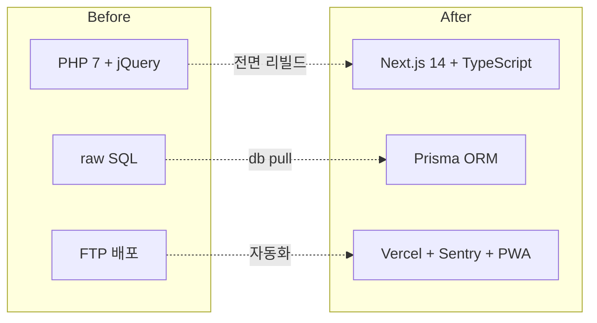

# PHP에서 Next.js로 — 전면 리빌드를 결정한 이유

VocaTokTok은 10년 넘게 PHP + Vanilla JS로 운영된 영어 학습 플랫폼입니다. 새 기능을 추가할 때마다 jQuery 셀렉터를 추적하고, SQL이 뷰 파일에 섞인 코드를 해독해야 했습니다. 이 글은 왜 점진적 마이그레이션이 아닌 전면 리빌드를 선택했는지, 그리고 새 스택을 어떻게 구성했는지 정리합니다.

## 왜 전면 리빌드인가

점진적 마이그레이션(Strangler Fig)이 일반적으로 안전하다고 알려져 있지만, VocaTokTok의 상황은 달랐습니다.

1. **재사용할 코드가 없다**: 비즈니스 로직이 뷰와 완전히 결합되어 있어서 추출 자체가 불가능합니다. 점진적으로 전환해도 결국 모든 코드를 다시 작성해야 합니다.
2. **핵심 자산은 코드가 아니라 DB**: MySQL에 축적된 학습 데이터가 진짜 자산입니다. 코드를 전부 갈아엎더라도 DB만 유지하면 됩니다.
3. **1인 개발 환경에서 병행 운영은 비현실적**: nginx에서 PHP와 Next.js를 경로별로 분기하면 세션 공유, 인증 동기화, CSS 충돌 등 부수 문제가 생깁니다.

## Next.js 14를 선택한 이유

여러 프레임워크를 검토했지만 Next.js 14의 App Router가 가장 적합했습니다.

- **Server Components**: PHP의 "서버에서 데이터 가져와서 렌더링"하는 패턴이 RSC에서 타입 안전하게 부활합니다. PHP 개발 경험이 오히려 자연스러운 전환을 도왔습니다.
- **Route Groups**: `(api)`, `study/`, `admin/` 등 기능별 라우트 그룹으로 학습 영역과 관리 영역을 깔끔하게 분리할 수 있습니다.
- **풀스택 단일 프로젝트**: API Route Handlers로 별도 백엔드 서버 없이 프론트엔드와 API를 하나의 프로젝트에서 관리합니다.

```
src/app/
├── admin/          # 학원 관리
├── ai/             # AI 학습 기능
├── api/            # API Route Handlers
├── basic/          # 기본 학습
├── fun/            # 재미 학습
├── report/         # 리포트
├── study/          # 핵심 학습 페이지
└── user/           # 사용자 관리
```

## Prisma 인트로스펙션 전략

새 프레임워크를 도입하면서도 DB는 그대로 유지해야 했습니다. Prisma의 `db pull` 명령이 이 문제를 해결했습니다.

```bash
# 기존 MySQL 스키마를 introspect하여 schema.prisma 자동 생성
prisma db pull && prisma generate
```

이 한 줄로 **63개 모델, 약 800라인**의 타입 안전한 스키마가 자동으로 만들어졌습니다. DB 마이그레이션 리스크 제로. 빌드 스크립트에 체이닝하여 빌드할 때마다 DB 스키마와 Prisma Client가 자동 동기화됩니다.

```json
{
  "build": "prisma db pull && prisma generate && next build"
}
```

MySQL을 PostgreSQL 등으로 전환하지 않은 이유도 명확합니다. 10년치 데이터가 MySQL에 있고, 학원에서 실시간으로 사용 중인 프로덕션 DB입니다. ORM 레이어만 교체하는 것이 가장 안전한 전략이었습니다.

## 함께 도입한 스택

| 역할 | Before (PHP) | After (Next.js 14) |
|---|---|---|
| DB 접근 | mysqli raw SQL | Prisma ORM (63 모델) |
| 상태 관리 | 전역 변수 + jQuery | Zustand |
| 런타임 검증 | 없음 | Zod |
| 스타일링 | 인라인 CSS | Tailwind + Mantine |
| 모니터링 | 없음 | Sentry |
| 배포 | FTP 수동 | Vercel 자동 |
| 오프라인 | 불가 | next-pwa |



## 핵심 인사이트

- **전면 리빌드가 정답인 경우가 있다**: 재사용할 코드가 없고 DB를 그대로 가져올 수 있다면, 병행 운영 비용이 리빌드보다 클 수 있음
- **Prisma db pull이 마이그레이션의 핵심 도구**: 기존 스키마를 introspect하여 타입 안전한 ORM 레이어를 자동 생성. 데이터 유실 리스크 제로
- **PHP 경험이 App Router 전환에 유리**: "서버에서 렌더링하고 클라이언트에서 조작"하는 PHP 패턴이 Server Components에서 타입 안전하게 부활
