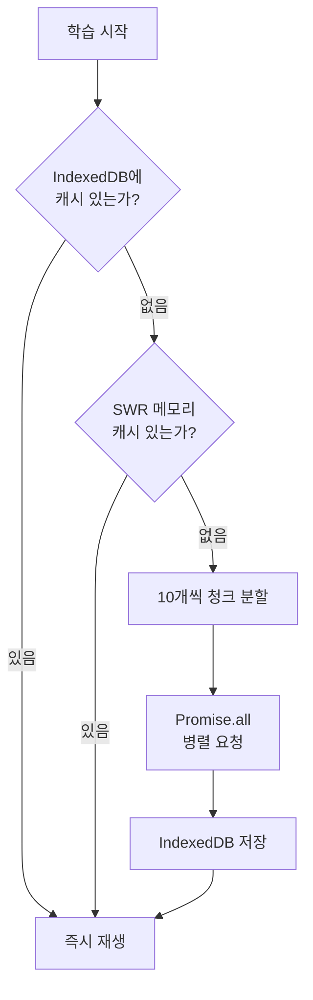

# 수천 단어의 발음을 끊김 없이 재생하려면

VocaTokTok에서 학생은 영어 단어를 보며 원어민 발음을 반복해서 듣습니다. Google Cloud TTS로 고품질 발음을 제공하는데, 문제는 학습 한 세션에 수십~수백 단어의 발음을 요청해야 한다는 점입니다. 매번 API를 호출하면 지연이 발생하고, 비용도 급증합니다. 이 글은 SWR 캐싱과 배치 분할로 대량 TTS 요청을 최적화한 설계를 정리합니다.

## 문제: 단어 하나당 API 호출 4번

VocaTokTok의 TTS는 단순하지 않습니다. 한 단어에 대해 영어 남성, 영어 여성, 한국어 남성, 한국어 여성 — 총 4가지 음성을 준비해야 합니다. 학습 중 남녀 목소리를 번갈아 재생하여 다양한 발음에 노출시키기 위해서입니다. 단어 50개짜리 세션이면 API 호출이 200번. 여기에 일본어, 중국어, 베트남어 등 다국어까지 지원하면 호출 수는 더 늘어납니다.

## 3단계 캐싱 아키텍처

이 문제를 해결하기 위해 3단계 캐싱 구조를 설계했습니다.



### 1단계: IndexedDB 영구 캐싱

`useSharedIndexedDB` 훅이 브라우저의 IndexedDB에 음성 데이터를 영구 저장합니다. 한번 생성된 TTS 음성은 다시 API를 호출할 필요가 없습니다.

```typescript
// 캐시 키 구조: word/eng/male/apple
const storeKey = `${prefix}/${lang}/${gender}/${formatFileName(text)}`;
const existingAudio = await getAudio(storeKey);
if (existingAudio) return; // 캐시 히트 — API 호출 스킵
```

학습 시작 시 `filterUnCached` 함수가 전체 단어 목록에서 아직 캐싱되지 않은 단어만 필터링합니다. 이미 한번 학습한 단어는 네트워크 요청 없이 즉시 재생됩니다.

### 2단계: SWR 메모리 캐싱

`useTTS` 훅은 SWR의 인메모리 캐시를 활용합니다. 같은 세션 내에서 동일한 요청이 중복 발생하면 네트워크 요청 없이 캐시된 결과를 반환합니다.

```typescript
const { data: cachedData, mutate } = useSWR<TTSResponse>(TTS_CACHE_KEY);

const trigger = async (request: TTSRequest) => {
  const key = JSON.stringify(request);
  if (cachedData && key === JSON.stringify(cachedData.request)) {
    return cachedData; // SWR 캐시 히트
  }
  const result = await originalTrigger(request);
  mutate({ ...result, request }, false); // 캐시 갱신
  return result;
};
```

### 3단계: 10개 청크 배치 병렬 요청

캐시 미스가 발생한 단어들은 `CHUNK_SIZE = 10` 단위로 분할하여 병렬 요청합니다. 한 번에 100개를 보내면 타임아웃 위험이 있고, 1개씩 보내면 너무 느립니다. 10개가 API 응답 시간과 병렬 처리 효율의 균형점이었습니다.

```typescript
const CHUNK_SIZE = 10;

// textList를 10개씩 분할
for (let i = 0; i < textList.length; i += CHUNK_SIZE) {
  chunks.push({ textList: textList.slice(i, i + CHUNK_SIZE), ...rest });
}

// 모든 청크를 병렬 요청
const results = await Promise.all(
  chunks.map(async (chunkArg) => {
    const response = await fetch(url, {
      method: "POST",
      body: JSON.stringify(chunkArg),
    });
    return response.json();
  })
);
```

## Prefetch 전략: 학습 시작 전에 미리 다운로드

`useTTSPrefetch` 훅은 학습 화면이 로딩되는 동안 해당 세션의 모든 단어 발음을 미리 다운로드합니다. 영어/한국어 x 남성/여성 = 4개 조합을 동시에 `Promise.all`로 요청하여, 학생이 실제 학습을 시작할 때는 모든 발음이 IndexedDB에 준비되어 있습니다.

## 재생 시스템: 남녀 교대 반복

`useSpeechTTS` 훅은 IndexedDB에서 남성/여성 음성을 가져와 교대로 재생합니다. 학습 설정의 `sound_loop` 값에 따라 반복 횟수가 결정되고, 문제가 바뀌면 `speechNumRef`로 이전 재생을 즉시 취소합니다. Google Cloud TTS 음성이 없는 환경에서는 브라우저 내장 `SpeechSynthesis` API로 자동 폴백합니다.

## 핵심 인사이트

- **3단계 캐싱으로 API 호출 최소화**: IndexedDB(영구) + SWR(세션) + Prefetch(선행)로 동일 단어는 최초 1회만 API 호출
- **10개 청크 분할이 최적 균형점**: 너무 크면 타임아웃, 너무 작으면 비효율. 실제 운영에서 10개가 응답 시간과 처리량의 균형
- **Prefetch로 체감 지연 제로**: 학습 화면 로딩 중 백그라운드에서 모든 발음을 미리 다운로드. 학생은 끊김을 느끼지 못함
