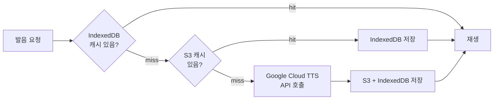

# 원어민 발음을 코드로 만들다

외국어 학습에서 발음은 텍스트만으로 전달할 수 없다. VocaTokTok은 Google Cloud TTS API로 원어민 수준의 발음을 제공한다. 처음에는 영어/한글만 지원했지만, 이후 다국어로 확장하면서 남녀 음성까지 포함해 호출량이 급격히 늘어났다. 발음 합성 자체보다 **합성 결과를 어떻게 재사용할 것인가**가 핵심 과제였다.

## 왜 Google Cloud TTS인가

TTS 서비스를 검토했을 때 Google Cloud TTS가 비용, 음성 품질, 개발 편의성 모두 균형이 잘 맞았다. API가 깔끔하고 다국어 음성 지원이 폭넓어서 이후 언어 확장에도 무리가 없었다.

## 단어 하나에 API 호출이 4번이다

한 단어에 대해 영어 남성, 영어 여성, 한국어 남성, 한국어 여성 — 총 4가지 음성을 준비한다. 학습 중 남녀 목소리를 번갈아 재생하여 다양한 발음에 노출시키기 위해서다. 단어 50개짜리 세션이면 API 호출이 200번. 다국어까지 지원하면 호출 수는 더 늘어난다.

매번 API를 호출하면 비용도 문제지만, **합성에 시간이 걸린다**는 게 더 큰 문제였다. 학습 중에 발음 합성을 기다리게 하면 UX가 무너진다. 캐싱이 필수였다.

## 3단계 캐싱으로 합성 대기 시간을 없앤다

**1단계: IndexedDB** — 클라이언트 브라우저에 저장된 캐시다. 같은 단어를 다시 학습할 때 네트워크 요청 없이 즉시 재생된다. 가장 빠르다.

**2단계: S3** — 서버 측 캐시다. 한 번 합성된 음성 파일을 S3에 저장해두면, 다른 학생이 같은 단어를 학습할 때 API 호출 없이 S3에서 가져온다.

**3단계: Google Cloud TTS** — S3에도 없는 새 단어일 때만 API를 호출한다. 합성된 음성은 S3와 IndexedDB 양쪽에 저장되어 다음부터는 캐시에서 서빙된다.

S3와 IndexedDB 모두 실패하면 **브라우저 내장 Web SpeechSynthesis API로 폴백**한다. 품질은 떨어지지만 학습이 멈추지는 않는다.

## 캐시 히트율을 높이는 키 설계

캐시 키를 데이터의 row ID로 잡으면 간단하지만, 캐시 히트율이 떨어진다. 같은 단어 "abandon"이 여러 단어장에 각각 다른 row ID로 존재하기 때문이다. 단어장 A의 "abandon"과 단어장 B의 "abandon"은 발음이 동일한데, row ID 기준 캐싱이면 각각 따로 합성해야 한다.

그래서 **실제 발음 텍스트를 기준으로 캐시 키를 구성**했다. 텍스트 + 언어 + 음성 타입의 조합이 키가 된다. 어떤 단어장에 속해 있든, 발음할 텍스트가 같으면 같은 캐시를 사용한다. 이 설계 하나로 중복 합성이 크게 줄었다.

## 학습 시작 전에 미리 다 준비한다

학습 중에 발음이 로딩되면 흐름이 끊긴다. 세션이 시작되면 **해당 세션의 모든 단어 발음을 미리 프리페치**한다. 10개 단위 청크로 나눠서 병렬 요청하고, 프로그레스 모달로 다운로드 진행률을 보여준다. 프리페치가 완료되면 학습이 시작된다.

이렇게 하면 학습 중에는 모든 발음이 IndexedDB에 준비되어 있어서 **끊김 없는 재생**이 가능하다. 네트워크 상태와 무관하게 학습이 진행된다.

## 텍스트를 정규화해야 TTS가 제대로 읽는다

TTS API에 텍스트를 그대로 보내면 문제가 생긴다. 괄호, 특수문자, 불필요한 구두점이 포함되어 있으면 발음이 이상해진다. "abandon (v.)" → "어밴든 괄호 브이 마침표"처럼 읽어버린다.

API 호출 전에 **텍스트 정규화**를 거친다. 괄호와 내용물 제거, 특수문자 제거, 소문자 변환 — 이 전처리로 TTS가 깨끗한 발음을 생성한다. 문장 단위 TTS에서는 SSML(Speech Synthesis Markup Language)로 문장 경계를 표시해서, 긴 텍스트도 자연스럽게 끊어 읽도록 한다.

## 돌이켜보면

TTS 파이프라인의 핵심은 **"매번 합성하지 않는다"**였다. 3단계 캐싱으로 같은 발음을 두 번 합성하는 일이 없고, 프리페치로 학습 중 대기 시간이 없다. 특히 캐시 키를 row ID가 아닌 실제 발음 텍스트 기준으로 설계한 것이 캐시 히트율을 끌어올린 결정이었다. 발음 합성 자체보다 **캐싱 전략과 키 설계**가 학습 UX를 결정했다.
