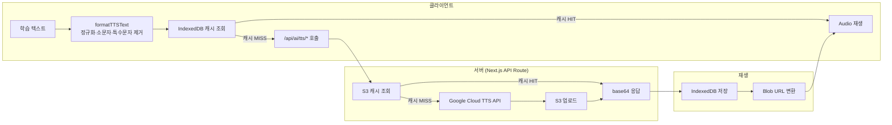

# 원어민 발음을 코드로 만들다

외국어 학습에서 발음은 텍스트만으로 전달할 수 없는 영역입니다. "pronunciation"의 강세가 어디에 있는지, "한국어 기초 사전"을 일본어로 어떻게 읽는지. 보카톡톡은 Google Cloud Text-to-Speech API를 중심으로 7개 언어 × 남녀 음성을 제공하는 TTS 파이프라인을 구축했습니다. 학습 텍스트가 입력되면 포맷팅, API 호출, S3 캐싱, IndexedDB 프리페치를 거쳐 학습자에게 원어민 수준의 발음이 재생됩니다.

## TTS 파이프라인 구조



핵심은 **2단계 캐싱**(S3 + IndexedDB)입니다. 같은 단어를 두 번째 학습할 때는 Google Cloud API를 호출하지 않고, 세 번째부터는 네트워크 요청 자체가 발생하지 않습니다.

## Google Cloud TTS 연동

서버 측 API Route에서 `@google-cloud/text-to-speech` 클라이언트를 초기화하고, 요청마다 `synthesizeSpeech`를 호출합니다.

```typescript
const client = new TextToSpeechClient({
  keyFilename: path.join(process.cwd(), "google-api-key.json"),
});

const request: google.cloud.texttospeech.v1.ISynthesizeSpeechRequest = {
  input: { text: targetText },
  voice: {
    languageCode: ttsTarget.code,   // "en-US", "ko-KR", "ja-JP" 등
    name: ttsTarget[gender].voice,  // "en-US-Standard-J" (male) 등
  },
  audioConfig: {
    audioEncoding: google.cloud.texttospeech.v1.AudioEncoding.MP3,
  },
};

const [response] = await client.synthesizeSpeech(request);
```

생성된 오디오는 `Buffer`로 변환한 뒤 S3에 업로드하고, 동시에 base64로 인코딩하여 클라이언트에 응답합니다. S3 업로드는 `await` 없이 fire-and-forget으로 처리하여 응답 지연을 최소화합니다.

### SSML로 문장 분할 재생

문장 학습 모드에서는 슬래시(`/`) 기호를 기준으로 끊어 읽기를 지원합니다. Plain text 대신 SSML을 입력으로 넘겨 `<break>` 태그로 구간 쉼을 삽입합니다.

```typescript
input: split
  ? {
      ssml: `<speak>${sentence.sentence.replace(
        /\//g,
        `/ <break time="${splitSpeed}s"/>`
      )}</speak>`,
    }
  : { text: sentence.sentence },
```

`splitSpeed`는 클라이언트에서 조절 가능하며, 기본값 0.5초입니다. 학습자가 끊어 읽기 속도를 조절할 수 있습니다.

## 다국어 지원

`ttsLangDict`와 `multiLangTTSLangDict` 두 개의 매핑 테이블로 언어별 음성을 관리합니다.

| 언어 | languageCode | 남성 음성 | 여성 음성 |
|---|---|---|---|
| 영어 | en-US | en-US-Standard-J | en-US-Standard-G |
| 한국어 | ko-KR | ko-KR-Standard-C | ko-KR-Standard-B |
| 일본어 | ja-JP | ja-JP-Chirp3-HD-Charon | ja-JP-Chirp3-HD-Aoede |
| 중국어 | cmn-CN | cmn-CN-Chirp3-HD-Charon | cmn-CN-Chirp3-HD-Aoede |
| 베트남어 | vi-VN | vi-VN-Chirp3-HD-Charon | vi-VN-Chirp3-HD-Aoede |
| 인도네시아어 | id-ID | id-ID-Chirp3-HD-Charon | id-ID-Chirp3-HD-Aoede |
| 러시아어 | ru-RU | ru-RU-Chirp3-HD-Charon | ru-RU-Chirp3-HD-Aoede |
| 아랍어 | ar-XA | ar-XA-Chirp3-HD-Charon | ar-XA-Chirp3-HD-Aoede |

영어·한국어는 Google Standard 음성을, 나머지 6개 언어는 Chirp3-HD 모델을 사용합니다. Chirp3-HD는 Google의 최신 멀티링구얼 TTS로, 하나의 화자 이름(Charon, Aoede)이 모든 언어에 걸쳐 일관된 음색을 제공합니다.

다국어 모드에서는 DB에서 `lang_no`로 언어를 조회한 뒤 해당 언어의 `code`를 꺼내 동적으로 음성을 선택합니다.

```typescript
if (lang_type === "multilang") {
  const lang_target = await prisma.multilingual_list.findFirst({
    where: { no: lang_no },
  });
  ttsTarget = multiLangTTSLangDict[lang_target.code];
}
```

## 텍스트 포맷팅 — TTS 입력 정규화

Google Cloud TTS는 입력 텍스트를 그대로 발음합니다. 괄호 안의 품사 표기, 특수문자, 대소문자 혼용이 있으면 발음이 부자연스러워집니다. `formatTTSText` 모듈이 이 문제를 처리합니다.

```typescript
// 단어 학습용: 영어·한국어만 남김
export const formatText = (text: string) => {
  return text
    .toLowerCase()                           // 소문자 통일
    .replace(/[\[\(\{].*?[\]\)\}]/g, "")     // 괄호+내용 제거 "(noun)" → ""
    .replace(/[^a-z0-9가-힣\s]/g, "")        // 영어·숫자·한글·공백만 남김
    .replace(/\s+/g, " ");                   // 연속 공백 정리
};

// 다국어 학습용: 모든 유니코드 문자 보존
export const formatMultilingualText = (text: string) => {
  return text
    .toLowerCase()
    .replace(/[\[\(\{].*?[\]\)\}]/g, "")
    .replace(/\s+/g, " ");
};
```

단어 학습(`formatText`)은 영어·한국어 문자만 남기지만, 다국어 학습(`formatMultilingualText`)은 일본어·중국어·베트남어 등 모든 유니코드 문자를 보존합니다. `formatFileName`은 여기에 공백을 언더스코어로 치환하여 S3 키와 IndexedDB 키로 사용합니다.

## RDT/RET 모드별 TTS 활용

보카톡톡에는 단어 학습, 문장 학습, 다국어 학습, 사용자 데이터 학습 등 여러 모드가 있습니다. 각 모드별로 TTS 훅이 분리되어 있습니다.

| 모드 | TTS 훅 | API 엔드포인트 | 특징 |
|---|---|---|---|
| 단어 학습 | `useTTS` + `useTTSPrefetch` | `/api/ai/tts/word` | 영어·한국어 단어, 텍스트 기반 캐시 키 |
| 다국어 학습 | `useMultilingualTTS` + `useMultiLingualTTSPrefetch` | `/api/ai/tts/multilingual/multiple` | 7개 언어, `lang_no` 기반 동적 음성 선택 |
| 사용자 데이터 | `useCreateDataTTS` + `useCreateDataTTSPrefetch` | `/api/ai/tts/createData` | 사용자 생성 단어장, `no` 기반 캐시 키 |
| 문장 학습 | (서버 직접 호출) | `/api/ai/tts/sentence` | SSML 분할 재생, `splitSpeed` 조절 |

재생 계층도 두 갈래로 분리됩니다. `advancedSpeech*` 함수는 IndexedDB에서 프리페치된 Google Cloud TTS 오디오를 `HTMLAudioElement`로 재생하고, `basicSpeech*` 함수는 브라우저 내장 `SpeechSynthesis` API를 폴백으로 사용합니다. 남성·여성 음성을 번갈아 재생하여 학습 효과를 높이는 것이 특징입니다.

```typescript
chk = await speech(audioUrlMale);      // 1회: 남성 음성
if (repeat > 2) {
  for (let i = 1; i < repeat; i++) {
    await new Promise((resolve) => setTimeout(resolve, 1000));
    chk = await speech(i % 2 === 0 ? audioUrlMale : audioUrlFemale);  // 교차 재생
  }
}
```

## 성능 최적화

### 2단계 캐싱: S3 + IndexedDB

1. **S3 캐시 (서버)**: 같은 텍스트+언어+성별 조합이 요청되면 Google Cloud API를 호출하지 않고 S3에서 바로 base64를 반환합니다. `getAudioAsBase64`로 S3에서 확인 후 없을 때만 TTS API를 호출합니다.
2. **IndexedDB 캐시 (클라이언트)**: `useSharedIndexedDB`를 통해 브라우저 로컬에 오디오를 저장합니다. `filterUnCached`가 이미 캐시된 단어를 필터링하여 서버 요청 자체를 줄입니다.

### 청크 분할 병렬 처리

단어 목록을 한 번에 보내면 API 타임아웃이 발생할 수 있습니다. `CHUNK_SIZE = 10`으로 분할하여 각 청크를 `Promise.all`로 병렬 처리합니다.

```typescript
const CHUNK_SIZE = 10;

for (let i = 0; i < textList.length; i += CHUNK_SIZE) {
  const chunk = textList.slice(i, i + CHUNK_SIZE);
  chunks.push({ textList: chunk, ...rest });
}

const results = await Promise.all(
  chunks.map(async (chunkArg) => {
    const response = await fetch(url, { ... });
    return response.json();
  })
);
const combinedAudios = results.flatMap((result) => result.audios);
```

### 프리페치 전략

학습 세션이 시작되면 해당 세션의 **모든 단어를 4가지 조합**(영어 남성, 영어 여성, 한국어 남성, 한국어 여성)으로 프리페치합니다. 학습 중 개별 단어를 클릭할 때는 이미 IndexedDB에 오디오가 있으므로 즉시 재생됩니다.

```typescript
const fetchList = async (engList: string[], korList: string[]) => {
  const fetchPromises = [];
  const engUnCachedMale = await filterUnCached(engList, "eng", "male");
  const engUnCachedFemale = await filterUnCached(engList, "eng", "female");
  fetchPromises.push(fetchMultipleAudio({ textList: engUnCachedMale, lang: "eng", gender: "male" }));
  fetchPromises.push(fetchMultipleAudio({ textList: engUnCachedFemale, lang: "eng", gender: "female" }));
  // 한국어도 동일하게 4방향 프리페치
  await Promise.all(fetchPromises);
};
```

### SpeechSynthesis 폴백

네트워크 오류나 IndexedDB 미지원 환경에서는 브라우저 내장 `SpeechSynthesis` API로 폴백합니다. 품질은 Google Cloud TTS보다 낮지만 오프라인에서도 동작합니다.

## 배운 점

- **2단계 캐싱이 비용과 UX를 동시에 잡는다**: S3 캐시로 Google Cloud API 호출 비용을 절감하고, IndexedDB 캐시로 네트워크 지연을 제거. 학습 앱에서 같은 단어를 반복 청취하는 패턴과 잘 맞아떨어짐
- **텍스트 정규화가 TTS 품질을 결정한다**: 괄호 안의 "(noun)", 특수문자, 대소문자 혼용을 제거하지 않으면 TTS가 그대로 발음. `formatText`와 `formatMultilingualText`를 분리하여 언어별 유니코드 범위를 정확히 보존하는 것이 핵심
- **프리페치 + 캐시 필터링 조합이 체감 성능을 바꾼다**: 학습 세션 시작 시 전체 단어를 프리페치하되, `filterUnCached`로 이미 있는 단어를 건너뜀. 두 번째 학습부터는 프리페치 시간이 거의 0에 수렴
- **청크 분할은 안정성과 속도의 균형**: 50개 단어를 한 번에 보내면 타임아웃, 1개씩 보내면 느림. CHUNK_SIZE=10의 병렬 처리가 실용적 타협점
- **fire-and-forget S3 업로드가 응답 속도를 높인다**: TTS 생성 후 S3 업로드를 `await` 없이 실행. 클라이언트는 base64를 즉시 받고, S3 저장은 백그라운드로 처리
- **폴백 계층이 서비스 안정성을 보장한다**: Google Cloud TTS(최고 품질) → SpeechSynthesis API(브라우저 내장)로 2단계 폴백. 네트워크 장애 시에도 발음 재생은 유지됨
