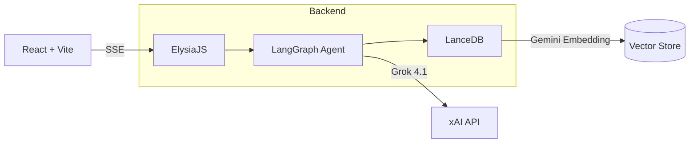

# 김형진 CV Implementation Plan

> **For Claude:** REQUIRED SUB-SKILL: Use superpowers:executing-plans to implement this plan task-by-task.

**Goal:** Bun 모노레포 기반 개인 이력서/포트폴리오 사이트 + RAG AI 챗봇 구축

**Architecture:** SaaS 대시보드 스타일 SPA(Vite+React) + API(ElysiaJS) 분리 구조. 백엔드는 chat/agent/knowledge로 관심사 분리. LanceDB에 사전 임베딩된 MD 콘텐츠를 Grok 4.1이 RAG로 답변.

**Tech Stack:** Bun, Vite, React, Tailwind CSS, React Router, ElysiaJS, LangChain.js, LangGraph, LanceDB, Gemini Embedding, Grok 4.1

---

### Task 1: Bun 모노레포 초기 설정

**Files:**
- Create: `package.json`
- Create: `bunfig.toml`
- Create: `packages/shared/package.json`
- Create: `packages/shared/src/index.ts`
- Create: `packages/server/package.json`
- Create: `packages/client/package.json`
- Create: `.gitignore`
- Create: `tsconfig.base.json`

**Step 1: 루트 package.json 생성**

```json
{
  "name": "genie-cv",
  "private": true,
  "workspaces": ["packages/*"],
  "scripts": {
    "dev:client": "bun --filter client dev",
    "dev:server": "bun --filter server dev",
    "dev": "bun run dev:client & bun run dev:server",
    "build": "bun --filter '*' build",
    "embed": "bun run scripts/embed.ts"
  }
}
```

**Step 2: .gitignore 생성**

```
node_modules/
dist/
.env
.env.local
*.db
*.lance/
```

**Step 3: tsconfig.base.json 생성**

```json
{
  "compilerOptions": {
    "target": "ES2022",
    "module": "ESNext",
    "moduleResolution": "bundler",
    "strict": true,
    "esModuleInterop": true,
    "skipLibCheck": true,
    "forceConsistentCasingInFileNames": true,
    "resolveJsonModule": true,
    "declaration": true,
    "declarationMap": true,
    "sourceMap": true
  }
}
```

**Step 4: shared 패키지 초기화**

`packages/shared/package.json`:
```json
{
  "name": "@genie-cv/shared",
  "version": "0.0.1",
  "private": true,
  "main": "src/index.ts",
  "types": "src/index.ts",
  "scripts": {
    "typecheck": "tsc --noEmit"
  }
}
```

`packages/shared/src/index.ts`:
```typescript
export interface ChatMessage {
  role: "user" | "assistant";
  content: string;
}

export interface Citation {
  text: string;
  source: string;
  route: string;
}

export interface ChatRequest {
  message: string;
  history: ChatMessage[];
}

export interface ChatSSEEvent {
  type: "token" | "citations" | "done" | "error";
  data: string | Citation[] | null;
}

export interface Project {
  slug: string;
  title: string;
  description: string;
  tags: string[];
  period: string;
  github?: string;
  demo?: string;
  features: { title: string; description: string }[];
  notes: BlogPostMeta[];
}

export interface BlogPostMeta {
  id: string;
  projectSlug: string;
  title: string;
  date: string;
  tags: string[];
  summary: string;
}

export interface QnAItem {
  question: string;
  answer: string;
}
```

**Step 5: bun install 실행**

Run: `bun install`

**Step 6: Commit**

```bash
git add -A
git commit -m "chore: initialize bun monorepo with shared types"
```

---

### Task 2: ElysiaJS 서버 초기 설정

**Files:**
- Create: `packages/server/package.json`
- Create: `packages/server/tsconfig.json`
- Create: `packages/server/src/index.ts`
- Create: `packages/server/src/config/env.ts`

**Step 1: server package.json 생성**

```json
{
  "name": "@genie-cv/server",
  "version": "0.0.1",
  "private": true,
  "scripts": {
    "dev": "bun --watch src/index.ts",
    "build": "bun build src/index.ts --outdir dist --target bun",
    "start": "bun dist/index.js"
  },
  "dependencies": {
    "@genie-cv/shared": "workspace:*",
    "elysia": "latest",
    "@elysiajs/cors": "latest"
  }
}
```

**Step 2: config/env.ts 생성**

```typescript
export const env = {
  PORT: Number(process.env.PORT) || 3001,
  CORS_ORIGIN: process.env.CORS_ORIGIN || "http://localhost:5173",
  XAI_API_KEY: process.env.XAI_API_KEY || "",
  GOOGLE_API_KEY: process.env.GOOGLE_API_KEY || "",
};
```

**Step 3: ElysiaJS 엔트리 생성**

```typescript
import { Elysia } from "elysia";
import { cors } from "@elysiajs/cors";
import { env } from "./config/env";

const app = new Elysia()
  .use(cors({ origin: env.CORS_ORIGIN }))
  .get("/health", () => ({ status: "ok" }))
  .listen(env.PORT);

console.log(`Server running on http://localhost:${env.PORT}`);

export type App = typeof app;
```

**Step 4: 서버 실행 확인**

Run: `cd packages/server && bun run dev`
Expected: `Server running on http://localhost:3001`

**Step 5: Commit**

---

### Task 3: Vite + React + Tailwind 클라이언트 설정

**Files:**
- Create: `packages/client/package.json`
- Create: `packages/client/tsconfig.json`
- Create: `packages/client/vite.config.ts`
- Create: `packages/client/index.html`
- Create: `packages/client/src/main.tsx`
- Create: `packages/client/src/App.tsx`
- Create: `packages/client/src/styles/global.css`

**Step 1: client package.json 생성**

```json
{
  "name": "@genie-cv/client",
  "version": "0.0.1",
  "private": true,
  "scripts": {
    "dev": "vite",
    "build": "tsc && vite build",
    "preview": "vite preview"
  },
  "dependencies": {
    "@genie-cv/shared": "workspace:*",
    "react": "^19",
    "react-dom": "^19",
    "react-router": "^7"
  },
  "devDependencies": {
    "@types/react": "^19",
    "@types/react-dom": "^19",
    "@vitejs/plugin-react": "^4",
    "autoprefixer": "^10",
    "postcss": "^8",
    "tailwindcss": "^4",
    "@tailwindcss/vite": "^4",
    "typescript": "^5",
    "vite": "^6"
  }
}
```

**Step 2: Vite + Tailwind 설정 파일 생성**

`packages/client/vite.config.ts`:
```typescript
import { defineConfig } from "vite";
import { resolve } from "path";
import react from "@vitejs/plugin-react";
import tailwindcss from "@tailwindcss/vite";

export default defineConfig({
  plugins: [react(), tailwindcss()],
  resolve: {
    alias: {
      "@data": resolve(__dirname, "../../data"),
    },
  },
  server: {
    port: 5173,
  },
});
```

**Step 3: React 엔트리 + App.tsx 라우팅 생성**

`packages/client/src/App.tsx`:
```tsx
import { Routes, Route } from "react-router";
import Sidebar from "./components/layout/Sidebar";
import DashboardPage from "./pages/DashboardPage";
import ProjectsPage from "./pages/ProjectsPage";
import ProjectDetailPage from "./pages/ProjectDetailPage";
import BlogPostPage from "./pages/BlogPostPage";
import QnAPage from "./pages/QnAPage";
import ChatPage from "./pages/ChatPage";

export default function App() {
  return (
    <div className="flex h-screen">
      <Sidebar />
      <main className="flex-1 overflow-auto">
        <Routes>
          <Route path="/" element={<DashboardPage />} />
          <Route path="/projects" element={<ProjectsPage />} />
          <Route path="/projects/:slug" element={<ProjectDetailPage />} />
          <Route path="/projects/:slug/notes/:id" element={<BlogPostPage />} />
          <Route path="/qna" element={<QnAPage />} />
          <Route path="/chat" element={<ChatPage />} />
        </Routes>
      </main>
    </div>
  );
}
```

**Step 4: bun install & 실행 확인**

Run: `bun install && cd packages/client && bun run dev`
Expected: Vite dev server on http://localhost:5173

**Step 5: Commit**

---

### Task 4: 사이드바 + Dashboard 페이지

> Pencil 디자인(design/design.pen) 참조하며 Tailwind 스타일 바로 적용.
> 디자인 시스템: Zinc 팔레트, Outfit(헤딩)/Inter(본문), rounded-xl 카드, bg-zinc-50 border-zinc-100, 사이드바 bg-zinc-50 border-r

**Files:**
- Create: `packages/client/src/components/layout/Sidebar.tsx`
- Create: `packages/client/src/pages/DashboardPage.tsx`
- Create: `packages/client/src/components/dashboard/AboutPanel.tsx`
- Create: `packages/client/src/components/dashboard/TechStackPanel.tsx`
- Create: `packages/client/src/components/dashboard/ProjectCard.tsx`
- Create: `packages/client/src/components/dashboard/EducationPanel.tsx`
- Create: `packages/client/src/components/dashboard/ExperiencePanel.tsx`

**Step 1: Sidebar 컴포넌트 생성**

고정 사이드바 (260px). 프로필(아바타 + 김형진 + AI Engineer), 네비게이션(About, Projects, Q&A, AI Chat), 하단 링크(GitHub, Email). 현재 활성 라우트 하이라이트.

**Step 2: Dashboard 패널 컴포넌트 생성**

- AboutPanel: 자기소개 텍스트
- TechStackPanel: collapsible. 접힌 상태 AI/ML, BACKEND, DB/MESSAGE. 열린 상태 + FRONTEND, DEVOPS/INFRA
- ProjectCard: 썸네일 + 제목 + 설명 + 태그 + 링크 (3개 미리보기)
- EducationPanel: 한양대학교 데이터사이언스학과 4학년 재학중 (2021~)
- ExperiencePanel: 경력/활동 타임라인

**Step 3: DashboardPage에 패널 조합**

레이아웃: Top Row(About + Tech Stack) → Projects Row(3 카드) → Bottom Row(Education + Experience)

**Step 4: 브라우저에서 확인**

Pencil 디자인(design/design.pen Dashboard Layout)과 일치하는지 확인.

**Step 5: Commit**

---

### Task 5: Projects 페이지 + Project Detail 페이지

> Pencil 디자인 참조하며 Tailwind 스타일 바로 적용.

**Files:**
- Create: `packages/client/src/pages/ProjectsPage.tsx`
- Create: `packages/client/src/pages/ProjectDetailPage.tsx`
- Create: `packages/client/src/pages/BlogPostPage.tsx`

**Step 1: ProjectsPage 생성**

2열 그리드 카드 레이아웃. 각 카드: 썸네일 + 제목 + 설명 + 기술 태그 + "자세히 보기" 링크. 인피니티 스크롤 (또는 전체 표시).

**Step 2: ProjectDetailPage 생성**

뒤로가기 링크 → 아키텍처 다이어그램(히어로) → 제목 + GitHub/Demo 버튼 → 기술 태그 → 프로젝트 설명 → 주요 기능 카드(3열 그리드) → 개발 노트 목록.

개발 노트 섹션: 제목 + 날짜 + 설명 + 태그. 클릭 시 `/projects/:slug/notes/:id`로 이동.

**Step 2-1: 커스텀 아키텍처 다이어그램 컴포넌트 생성**

프로젝트별/노트별 서비스 아키텍처를 시각화하는 커스텀 React+SVG 컴포넌트.
- 각 프로젝트/개발 노트마다 개별 컴포넌트 파일 생성 (Mermaid 파일은 참조용, UI에서 불러오지 않음)
- 실제 기술 로고 SVG 사용 (devicons/simple-icons에서 수집, `public/logos/`에 배치)
- 노드(로고+라벨), 엣지(화살표+라벨), 그룹(박스) 렌더링
- Projects 카드 썸네일에는 축소 버전, Detail 히어로에는 풀사이즈

```
packages/client/src/components/diagrams/
├── projects/                    # 프로젝트별 커스텀 React+SVG
│   ├── AiPortfolioChatbotArch.tsx
│   └── FinanceDashboardArch.tsx
└── notes/                       # 개발 노트별 커스텀 React+SVG
    ├── RagPipelineArch.tsx
    ├── SseStreamingArch.tsx
    └── LangGraphAgentArch.tsx
```

Create: `packages/client/src/components/diagrams/projects/*.tsx`
Create: `packages/client/src/components/diagrams/notes/*.tsx`
Create: `public/logos/*.svg` (기술 로고 파일들)

**Step 3: BlogPostPage 생성**

브레드크럼(Projects > 프로젝트명 > 개발 노트) → 제목 + 날짜 + 읽기 시간 + 태그 → 마크다운 렌더링 본문 (H2, 본문, 코드 블록). 본문은 `data/content/notes/{id}.md`를 런타임 fetch 후 react-markdown으로 렌더링.

**Step 4: 라우팅 연결 확인**

Projects → 카드 클릭 → Detail → 개발 노트 클릭 → BlogPost. 뒤로가기 동작 확인.

**Step 5: Commit**

---

### Task 6: Q&A 페이지 + AI Chat 페이지

> Pencil 디자인 참조하며 Tailwind 스타일 바로 적용.

**Files:**
- Create: `packages/client/src/pages/QnAPage.tsx`
- Create: `packages/client/src/pages/ChatPage.tsx`
- Create: `packages/client/src/components/chat/ChatMessage.tsx`
- Create: `packages/client/src/components/chat/ChatInput.tsx`
- Create: `packages/client/src/hooks/useChat.ts`
- Create: `packages/client/src/lib/api.ts`

**Step 1: QnAPage 생성**

셀프 Q&A 아코디언. 질문 클릭 시 답변 펼침/접힘. `data/qna.json`에서 로드.

**Step 2: api.ts SSE 유틸리티 생성**

```typescript
const API_BASE = import.meta.env.VITE_API_URL || "http://localhost:3001";

export async function* streamChat(message: string, history: Array<{ role: string; content: string }>) {
  const res = await fetch(`${API_BASE}/api/chat`, {
    method: "POST",
    headers: { "Content-Type": "application/json" },
    body: JSON.stringify({ message, history }),
  });

  const reader = res.body!.getReader();
  const decoder = new TextDecoder();
  let buffer = "";

  while (true) {
    const { done, value } = await reader.read();
    if (done) break;
    buffer += decoder.decode(value, { stream: true });
    const lines = buffer.split("\n");
    buffer = lines.pop()!;
    for (const line of lines) {
      if (line.trim()) yield JSON.parse(line);
    }
  }
}
```

**Step 3: useChat 훅 생성**

메시지 상태 관리, 스트리밍 수신, 인용 데이터 파싱.

**Step 4: ChatPage 생성**

전용 페이지 (플로팅 위젯 아님). Welcome 화면 + 추천 질문 버튼 → 질문 시 채팅 인터페이스. 인용 클릭 시 react-router로 해당 페이지 이동.

**Step 5: Commit**

---

### Task 7: 백엔드 knowledge 레이어 (RAG)

**Files:**
- Create: `packages/server/src/knowledge/loader.ts`
- Create: `packages/server/src/knowledge/retriever.ts`
- Create: `packages/server/src/knowledge/citations.ts`

**Step 1: LanceDB 의존성 추가**

Run: `cd packages/server && bun add @lancedb/lancedb`

**Step 2: loader.ts 생성**

LanceDB 테이블 연결. `packages/server/db/` 경로에서 임베딩된 데이터 로드.

**Step 3: retriever.ts 생성**

Gemini Embedding으로 쿼리 벡터화 → LanceDB 유사도 검색 → top-k 결과 반환.

**Step 4: citations.ts 생성**

검색 결과의 메타데이터(source 파일명)를 프론트 라우트로 매핑.

```typescript
import type { Citation } from "@genie-cv/shared";

const ROUTE_MAP: Record<string, string> = {
  "about.md": "/",
  "education.md": "/",
  "experience.md": "/",
  "qna.json": "/qna",
};

export function mapCitations(
  results: Array<{ text: string; source: string }>
): Citation[] {
  return results.map((r) => ({
    text: r.text.slice(0, 100),
    source: r.source,
    route:
      ROUTE_MAP[r.source] ||
      (r.source.startsWith("notes/") || r.source.startsWith("architectures/notes/")
        ? `/projects/${inferProjectSlug(r.source)}/notes/${extractId(r.source)}`
        : `/projects/${extractId(r.source)}`),
  }));
}
```

**Step 5: Commit**

---

### Task 8: 백엔드 agent 레이어 (LangChain + Grok)

**Files:**
- Create: `packages/server/src/agent/graph.ts`
- Create: `packages/server/src/agent/prompts/system.prompt.ts`
- Create: `packages/server/src/agent/tools/rag-search.tool.ts`

**Step 1: LangChain 의존성 추가**

Run: `cd packages/server && bun add langchain @langchain/core @langchain/langgraph @langchain/xai`

**Step 2: system.prompt.ts 생성**

```typescript
export const SYSTEM_PROMPT = `당신은 김형진의 개인 AI 어시스턴트입니다.
방문자의 질문에 제공된 컨텍스트를 기반으로 답변합니다.

규칙:
- 컨텍스트에 없는 정보는 추측하지 마세요.
- 답변 시 관련 소스를 인용하세요.
- 한국어로 답변하되, 기술 용어는 원문 유지.
- 친절하고 전문적인 톤을 유지하세요.`;
```

**Step 3: rag-search.tool.ts 생성**

LangChain Tool로 래핑. retrieve() 호출 후 결과를 포맷팅.

**Step 4: graph.ts 생성**

LangGraph로 에이전트 그래프 정의. Grok 4.1 모델 + ragSearchTool 바인딩.

**Step 5: Commit**

---

### Task 9: 백엔드 chat 레이어 (SSE 라우트)

**Files:**
- Create: `packages/server/src/chat/dto/chat.dto.ts`
- Create: `packages/server/src/chat/routes/chat.route.ts`
- Modify: `packages/server/src/index.ts`

**Step 1: chat.dto.ts 생성**

Elysia 요청 검증용 스키마 정의.

**Step 2: chat.route.ts 생성**

SSE 스트리밍 응답. agent를 호출하고 토큰 단위로 스트리밍. 마지막에 인용 정보 전송.

**Step 3: index.ts에 chat 라우트 연결**

**Step 4: Commit**

---

### Task 10: 데이터 파일 + 임베딩 스크립트 + 콘텐츠

**데이터 관리 원칙:** JSON은 프론트엔드 렌더링용, MD는 RAG 임베딩용, Mermaid(.mmd)는 아키텍처 참조+RAG용

**Files:**
- Create: `data/projects.json` (프론트엔드: 프로젝트 메타, 기능, 개발 노트 목록)
- Create: `data/qna.json` (프론트엔드: 셀프 Q&A 항목들)
- Create: `data/profile.json` (프론트엔드: 프로필, 학력, 경력, About)
- Create: `data/content/about.md`
- Create: `data/content/education.md`
- Create: `data/content/experience.md`
- Create: `data/content/projects/*.md`
- Create: `data/content/notes/*.md`
- Create: `data/architectures/projects/*.mmd`
- Create: `data/architectures/notes/*.mmd`
- Create: `scripts/embed.ts`

**Step 1: 프론트엔드 JSON 데이터 파일 생성**

`data/projects.json`: 프로젝트 목록 + 각 프로젝트별 기능 카드 + 개발 노트 목록
`data/qna.json`: 셀프 Q&A 질문/답변 배열
`data/profile.json`: 이름, 역할, About 텍스트, 학력, 경력, 연락처

**Step 2: RAG용 콘텐츠 MD 파일 생성**

- about.md: AI Engineer 자기소개
- education.md: 한양대학교 데이터사이언스학과 2021~ 재학중
- experience.md: 경력/활동
- projects/: 각 프로젝트별 상세 설명 MD
- notes/: 개발 노트 MD (RAG 파이프라인, SSE 스트리밍, LangGraph 에이전트 등)

**Step 3: Mermaid 아키텍처 파일 생성**

프로젝트별 대표 아키텍처 1개 + 개발 노트별 아키텍처 1개를 `.mmd` 파일로 작성.
임베딩 시 텍스트로 포함하여 RAG가 아키텍처 관련 질문에 답변 가능.
프론트엔드 UI에서는 이 파일을 불러오지 않고 별도 커스텀 React+SVG 컴포넌트로 제작.

예시 (`data/architectures/projects/ai-portfolio-chatbot.mmd`):


**Step 4: embed.ts 생성**

`data/content/` MD + `data/architectures/` Mermaid + `data/qna.json` (Q→A 텍스트 변환) 읽기 → 청크 분할 → Gemini Embedding → LanceDB 저장.

**Step 5: 실행 확인**

Run: `GOOGLE_API_KEY=<key> bun run scripts/embed.ts`
Expected: 각 파일별 청크 수 출력, LanceDB 저장 완료 메시지

**Step 6: Commit**

---

### Task 11: Railway 배포 설정

**Files:**
- Create: `packages/client/Dockerfile`
- Create: `packages/server/Dockerfile`
- Create: `packages/client/nginx.conf`

**Step 1: server Dockerfile 생성**

```dockerfile
FROM oven/bun:latest
WORKDIR /app
COPY package.json bun.lock ./
COPY packages/shared ./packages/shared
COPY packages/server ./packages/server
RUN bun install --frozen-lockfile
COPY packages/server/db ./packages/server/db
EXPOSE 3001
CMD ["bun", "run", "--filter", "server", "start"]
```

**Step 2: client Dockerfile 생성**

Vite 빌드 후 nginx로 정적 파일 서빙.

**Step 3: nginx.conf 생성 (SPA 라우팅)**

```nginx
server {
    listen 80;
    root /usr/share/nginx/html;
    index index.html;
    location / {
        try_files $uri $uri/ /index.html;
    }
}
```

**Step 4: Railway에서 두 서비스 생성 및 배포 확인**

**Step 5: Commit**

---

## 태스크 의존성

```
Task 1 (모노레포) → Task 2 (서버) → Task 7 (knowledge) → Task 8 (agent) → Task 9 (chat route)
Task 1 (모노레포) → Task 3 (클라이언트) → Task 4 (사이드바/Dashboard) → Task 5 (Projects/Detail/Blog)
Task 5 → Task 6 (Q&A/Chat 페이지)
Task 1 (모노레포) → Task 10 (데이터/임베딩/콘텐츠)
Task 6 + Task 9 + Task 10 → Task 11 (배포)
```
