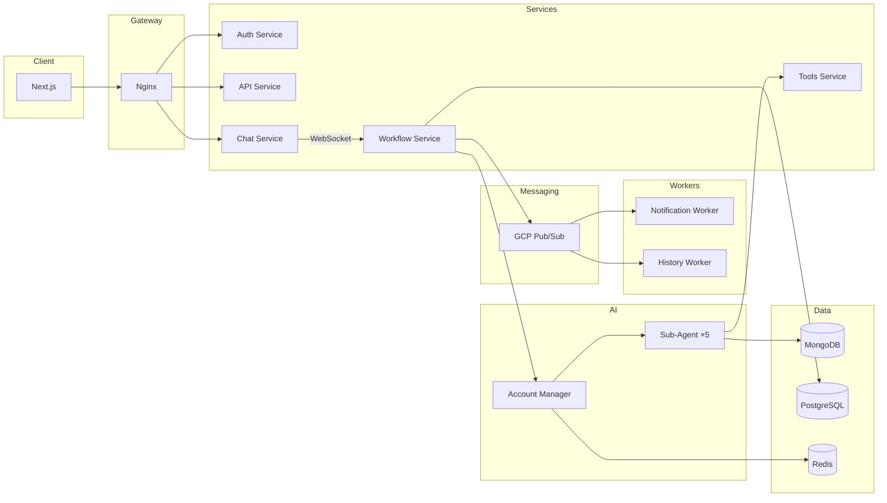

# kimpro-agent-service 포트폴리오 추가 Implementation Plan

> **For agentic workers:** REQUIRED SUB-SKILL: Use superpowers:subagent-driven-development (recommended) or superpowers:executing-plans to implement this plan task-by-task. Steps use checkbox (`- [ ]`) syntax for tracking.

**Goal:** genie-cv 포트폴리오 사이트에 kimpro-agent-service 프로젝트를 데이터, 콘텐츠, 히어로 컴포넌트와 함께 추가하고, RAG 임베딩을 재실행한다.

**Architecture:** projects.json에 프로젝트 메타데이터를 추가하고, 8개 개발 노트 마크다운과 Mermaid 다이어그램을 생성한다. KimproHero SVG 인터랙티브 컴포넌트를 FingooHero 패턴으로 구현하고, 프론트엔드 라우팅을 연결한 뒤 임베딩 파이프라인을 재실행한다.

**Tech Stack:** React, TypeScript, Motion (framer-motion), SVG, Markdown, Mermaid, Gemini Embedding, LanceDB

**Spec:** `docs/superpowers/specs/2026-03-18-kimpro-portfolio-addition-design.md`

---

### Task 1: projects.json에 kimpro 프로젝트 엔트리 추가

**Files:**
- Modify: `data/projects.json` — 배열 index 0에 kimpro 엔트리 삽입

**Reference:** 스펙 문서 Section 1의 완전한 JSON 엔트리 사용. 기존 fingoo, ai-portfolio-chatbot 엔트리의 스키마 패턴과 일치해야 함.

- [ ] **Step 1: projects.json 수정**

`data/projects.json`의 배열 첫 번째에 kimpro 엔트리를 삽입. 스펙 문서의 JSON 블록 전체를 그대로 사용.

필수 검증 포인트:
- `slug`: `"kimpro"` (URL-safe, kebab-case)
- `tags`: 11개, 처음 4개가 LangChain, Fastify, GCP Pub/Sub, WebSocket
- `features`: 6개 객체
- `notes`: 8개 객체, 모두 `"projectSlug": "kimpro"` 포함
- `period`: `"2025.09 ~ 2026.03"` (점 구분자)
- notes의 `date`: ISO 8601 형식 (`YYYY-MM-DD`)
- github/demo 필드 없음

- [ ] **Step 2: JSON 유효성 검증**

Run: `cd /Users/genie/workspace/genie-cv && node -e "JSON.parse(require('fs').readFileSync('data/projects.json','utf8')); console.log('Valid JSON')"`
Expected: `Valid JSON`

- [ ] **Step 3: 커밋**

```bash
git add data/projects.json
git commit -m "feat: projects.json에 kimpro 프로젝트 엔트리 추가"
```

---

### Task 2: profile.json techStack 업데이트

**Files:**
- Modify: `data/profile.json` — techStack 섹션

- [ ] **Step 1: profile.json 수정**

다음 변경 적용:
- `AI/ML` 배열에 `"Claude"` 추가
- `BACKEND` 배열에 `"Fastify"` 추가 (ElysiaJS 뒤)
- `DB/MESSAGE` 배열에 `"MongoDB"`, `"GCP Pub/Sub"` 추가 (Kafka 유지)

변경 전:
```json
"AI/ML": ["LangChain", "RAG", "Gemini", "Grok", "HuggingFace"],
"BACKEND": ["ElysiaJS", "FastAPI", "Node.js", "Bun"],
"DB/MESSAGE": ["LanceDB", "PostgreSQL", "Redis", "Kafka"],
```

변경 후:
```json
"AI/ML": ["LangChain", "RAG", "Gemini", "Grok", "HuggingFace", "Claude"],
"BACKEND": ["ElysiaJS", "Fastify", "FastAPI", "Node.js", "Bun"],
"DB/MESSAGE": ["LanceDB", "PostgreSQL", "MongoDB", "Redis", "GCP Pub/Sub", "Kafka"],
```

- [ ] **Step 2: 커밋**

```bash
git add data/profile.json
git commit -m "feat: profile.json techStack에 kimpro 관련 스택 추가"
```

---

### Task 3: experience.md 아이머스 경력 보강

**Files:**
- Modify: `data/content/experience.md`

**Reference:** 현재 파일은 Sample Company 플레이스홀더. 실제 아이머스 경력으로 교체.

- [ ] **Step 1: experience.md 수정**

현재 내용을 실제 경력 데이터로 교체. `data/profile.json`의 experience 배열과 일치시킴.

```markdown
# 경력 및 활동

## 백엔드/AI 엔지니어 | 아이머스 (2025.09 ~ 2026.03)

현장실습생/인턴. 인플루언서-브랜드 매칭 AI 서비스 개발.

- LangChain 기반 멀티에이전트 시스템 설계 — Account Manager가 5개 전문 에이전트를 오케스트레이션하는 캠페인 자동화 워크플로우
- GCP Pub/Sub 기반 이벤트 드리븐 마이크로서비스 아키텍처 설계 및 운영 (Auth·API·Chat·Workflow·Tools·Notification·History 7개 서비스)
- WebSocket 실시간 스트리밍 파이프라인 구축 — messages·updates·tasks 3가지 모드로 Agent 실행 상황 전달
- Redis CAS 패턴 기반 캠페인 스냅샷/롤백 시스템 구현, PostgreSQL 체크포인팅으로 Agent 대화 영속화
- Anthropic Prompt Caching을 활용한 비용·지연 시간 최적화
- Agent 품질 평가 체계 구축 및 자동화된 프롬프트 개선 루프

## 풀스택 개발자 | 스톰스터디 (2025.02 ~ 2025.08)

정규직. 영어 단어 학습 플랫폼 복귀 후 신규 기능 개발 및 서비스 운영.

- AI 기반 학습 기능 고도화, 사용자 피드백 반영한 UX 개선

## FE/AI 개발자 | 핀구 (2024.12 ~ 2026.03)

창업팀 활동. 주식 투자 결정 보조 AI 서비스 개발.

- NestJS+Puppeteer 금융 데이터 크롤러, PostgreSQL+pgvector 벡터 DB 파이프라인 구축
- LangChain 기반 Multi-Agent 시스템 설계 (Supervisor 패턴, 7개 전문 에이전트)
- FastAPI 백엔드 AWS EC2 배포, Next.js 채팅 UI 개발

## 풀스택 개발자 | 헬프터 (2024.11 ~ 2025.01)

정규직. 풀스택 웹 서비스 개발.

## 풀스택 개발자 | 스톰스터디 (2021.02 ~ 2023.04)

프리랜서/정규직. 영어 단어 학습 플랫폼 '스톰스터디'의 풀스택 개발.

- PHP/Vanilla JS 레거시를 Next.js로 마이그레이션, TypeScript 전면 도입
- MySQL DB 설계, Vercel AI SDK로 AI 학습 기능 및 개인화 알고리즘 구현
```

- [ ] **Step 2: 커밋**

```bash
git add data/content/experience.md
git commit -m "feat: experience.md 실제 경력 데이터로 보강"
```

---

### Task 4: FingooHero marker id 정리

**Files:**
- Modify: `apps/client/src/components/ProjectHero.tsx`

**Reference:** 현재 FingooHero는 `id="arrow"`를 사용. ChatbotHero는 `id="chatbot-arrow"`, KimproHero는 `id="kimpro-arrow"`를 사용할 예정. 일관성을 위해 `fingoo-arrow`로 변경.

- [ ] **Step 1: marker id 변경**

`apps/client/src/components/ProjectHero.tsx`에서:
- `id="arrow"` → `id="fingoo-arrow"` (marker 정의)
- `markerEnd="url(#arrow)"` → `markerEnd="url(#fingoo-arrow)"` (Arrow 컴포넌트 내 참조)

2곳 수정: `<marker id="arrow">` 정의 (line ~281)와 Arrow 컴포넌트 함수 내 `markerEnd="url(#arrow)"` (line ~128). Arrow 컴포넌트의 단일 변경이 모든 화살표 인스턴스에 전파됨.

- [ ] **Step 2: 로컬에서 fingoo 프로젝트 페이지 확인**

Run: `cd /Users/genie/workspace/genie-cv && bun run dev:client`

브라우저에서 `/projects/fingoo` 접속하여 화살표가 정상 렌더링되는지 확인.

- [ ] **Step 3: 커밋**

```bash
git add apps/client/src/components/ProjectHero.tsx
git commit -m "refactor: FingooHero marker id를 fingoo-arrow로 변경"
```

---

### Task 5: KimproHero 컴포넌트 생성

**Files:**
- Create: `apps/client/src/components/KimproHero.tsx`

**Reference:** `apps/client/src/components/ProjectHero.tsx` (FingooHero)를 베이스로 복사 후 수정. 스펙 Section 2의 노드 배치, 화살표, 색상을 정확히 따름.

> Note: Node, Arrow, 줌/패닝 로직이 FingooHero/ChatbotHero/KimproHero에 중복됨. 공통 모듈 추출은 이번 스코프에서 제외하고, 기존 패턴(각 히어로가 로컬 컴포넌트를 가짐)을 따름. 추후 리팩토링 가능.

- [ ] **Step 1: KimproHero.tsx 생성**

FingooHero 파일을 복사하여 다음을 변경:
- 컴포넌트명: `FingooHero` → `KimproHero`
- Node 색상 타입: `"violet" | "emerald" | "blue" | "amber" | "zinc"` (FingooHero와 동일)
- marker id: `fingoo-arrow` → `kimpro-arrow`
- 배경 그라디언트: `from-slate-50 via-emerald-50/30 to-amber-50/20`
- 좌상단 타이틀: `AIMERS` + `[ SERVICE_FLOW ]`
- 하단 텍스트: `LangChain multi-agent · GCP Pub/Sub · WebSocket streaming`

노드 배치 (스펙 Section 2 테이블 기준):

```tsx
{/* 사용자 (왼쪽) */}
<Node x={20} y={100} w={75} h={48} label="사용자" color="violet" delay={FLOW_DELAY} />

{/* 실선: 사용자 → 데이터 분석 */}
<Arrow points="95,124 125,100" delay={FLOW_DELAY * 2} />

{/* 데이터 분석 */}
<Node x={125} y={75} w={110} h={50} label="데이터 분석" sub="URL·PDF → AI 크롤링" color="blue" delay={FLOW_DELAY * 3} />

{/* 실선: 데이터 분석 → 캠페인 구성 */}
<Arrow points="235,100 265,100" delay={FLOW_DELAY * 4} />

{/* 캠페인 구성 */}
<Node x={265} y={75} w={110} h={50} label="캠페인 구성" sub="AI 대화로 자동 생성" color="emerald" delay={FLOW_DELAY * 5} />

{/* 실선: 캠페인 구성 → 크리에이터 매칭 */}
<Arrow points="375,100 405,100" delay={FLOW_DELAY * 6} />

{/* 크리에이터 매칭 */}
<Node x={405} y={75} w={110} h={50} label="크리에이터 매칭" sub="AI 주도 컨택 · 계약" color="amber" delay={FLOW_DELAY * 7} />

{/* 실선: 크리에이터 매칭 → 모니터링 */}
<Arrow points="515,100 545,124" delay={FLOW_DELAY * 8} />

{/* 모니터링 (오른쪽) */}
<Node x={545} y={100} w={75} h={48} label="모니터링" color="emerald" delay={FLOW_DELAY * 9} />

{/* 점선: 데이터 레이어 */}
<Arrow points="180,125 180,170" delay={FLOW_DELAY * 10} dashed />
<Arrow points="320,125 320,170" delay={FLOW_DELAY * 10} dashed />
<Arrow points="460,125 460,170" delay={FLOW_DELAY * 10} dashed />

{/* 데이터 레이어 노드 */}
<Node x={125} y={170} w={110} h={34} label="크롤링 엔진" color="zinc" delay={FLOW_DELAY * 11} />
<Node x={265} y={170} w={110} h={34} label="크리에이터 DB" sub="특성 분석" color="zinc" delay={FLOW_DELAY * 11.5} />
<Node x={405} y={170} w={110} h={34} label="AI 커뮤니케이션" sub="연락 · 계약 · 대화" color="zinc" delay={FLOW_DELAY * 12} />
```

- [ ] **Step 2: 커밋**

```bash
git add apps/client/src/components/KimproHero.tsx
git commit -m "feat: KimproHero 인터랙티브 SVG 컴포넌트 생성"
```

---

### Task 6: 프론트엔드 라우팅 연결

**Files:**
- Modify: `apps/client/src/pages/ProjectDetailPage.tsx` — Hero 분기 + import 추가
- Modify: `apps/client/src/components/dashboard/ProjectCard.tsx` — 썸네일 분기 + import 추가

- [ ] **Step 1: ProjectDetailPage.tsx 수정**

import 추가:
```tsx
import { KimproHero } from "../components/KimproHero";
```

Hero 분기에 kimpro 케이스 추가 (fingoo 분기 앞에):
```tsx
project.slug === "kimpro" ? (
  <KimproHero className="h-[360px]" interactive />
) : project.slug === "fingoo" ? (
```

- [ ] **Step 2: ProjectCard.tsx 수정**

import 추가:
```tsx
import { KimproHero } from "../KimproHero";
```

`ProjectHeroThumbnail` 함수에 kimpro 분기 추가 (fingoo 분기 앞에):
```tsx
if (slug === "kimpro") return <KimproHero className={className} />;
```

- [ ] **Step 3: 로컬 확인**

Run: `cd /Users/genie/workspace/genie-cv && bun run dev:client`

확인 사항:
- 프로젝트 목록 페이지에서 kimpro 카드가 첫 번째에 히어로 썸네일과 함께 표시
- `/projects/kimpro` 접속 시 KimproHero 다이어그램, features 6개, notes 8개 표시
- 노트 클릭 시 `/projects/kimpro/notes/{id}` 라우트로 이동 (콘텐츠 없어서 빈 페이지 또는 에러 — 다음 Task에서 해결)

- [ ] **Step 4: 커밋**

```bash
git add apps/client/src/pages/ProjectDetailPage.tsx apps/client/src/components/dashboard/ProjectCard.tsx
git commit -m "feat: ProjectDetailPage·ProjectCard에 kimpro 히어로 분기 추가"
```

---

### Task 7: 프로젝트 콘텐츠 마크다운 + Mermaid 아키텍처

**Files:**
- Create: `data/content/projects/kimpro.md`
- Create: `data/architectures/projects/kimpro.mmd`

**Reference:** `data/content/projects/fingoo.md` 스타일. H2: 프로젝트 개요, 기술 스택, 주요 기능, 담당 영역. 비즈니스 로직 최소화, 기술 아키텍처 중심.

- [ ] **Step 1: kimpro.md 작성**

`data/content/projects/kimpro.md` — 약 60~80줄.

구조:
```markdown
# Aimers — AI 인플루언서 마케팅 자동화 플랫폼

인플루언서 마케팅 캠페인을 AI가 자동 수행하는 플랫폼입니다.

## 프로젝트 개요
(2-3문단: 서비스 설명, 기술적 특징)

## 기술 스택
(불릿 리스트: LangChain, Fastify, GCP Pub/Sub 등)

## 주요 기능
### AI 멀티에이전트 캠페인 자동화
### 이벤트 드리븐 마이크로서비스
### 실시간 워크플로우 스트리밍
### 캠페인 스냅샷 & 롤백
### LangChain 미들웨어 파이프라인
### Agent 평가 및 Prompt Caching

## 담당 영역
(불릿 리스트: 본인이 한 일)
```

콘텐츠 작성 시 `~/workspace/kimpro-agent-service`의 실제 아키텍처를 참조하되, 코드는 노출하지 않음.

- [ ] **Step 2: kimpro.mmd 작성**

`data/architectures/projects/kimpro.mmd` — Mermaid graph LR 형식.



`data/architectures/projects/fingoo.mmd` 스타일에 맞춰 subgraph와 노드를 구성.

- [ ] **Step 3: 커밋**

```bash
git add data/content/projects/kimpro.md data/architectures/projects/kimpro.mmd
git commit -m "feat: kimpro 프로젝트 설명 마크다운 + Mermaid 아키텍처 추가"
```

---

### Task 8: 개발 노트 1~4 마크다운 작성

**Files:**
- Create: `data/content/notes/kimpro-marketing-automation.md`
- Create: `data/content/notes/kimpro-multi-agent.md`
- Create: `data/content/notes/kimpro-snapshot-rollback.md`
- Create: `data/content/notes/kimpro-realtime-streaming.md`

**Reference:** `data/content/notes/fingoo-agentic-ai.md` 스타일. 각 노트 약 150~250줄. 대화체 제목, 문제→해결 내러티브, Mermaid 다이어그램, 비교 테이블, "핵심 인사이트" 마무리.

콘텐츠 작성 시 `~/workspace/kimpro-agent-service`의 실제 코드와 아키텍처를 참조하되, 코드 스니펫은 노출하지 않고 의사코드나 다이어그램으로 대체.

- [ ] **Step 1: kimpro-marketing-automation.md 작성**

```markdown
# 매번 똑같은 일을 왜 사람이 해야 하지?

{도입부: 수동 프로세스의 고통}

## 배경 / 문제
## 기존 프로세스 분석
## Agent 워크플로우로의 전환
## 4단계 파이프라인 설계
## 결과 / 비즈니스 임팩트
## 핵심 인사이트
```

- [ ] **Step 2: kimpro-multi-agent.md 작성**

```markdown
# 혼자 다 하는 AI는 없다 — 팀장과 전문가 5명의 협업 구조

{도입부: 단일 에이전트의 한계}

## 배경 / 문제
## 왜 멀티에이전트인가
## 아키텍처 — Account Manager + Sub-Agents
## Tool Calling 기반 서브에이전트 라우팅
## 에이전트 간 상태 공유
## 트러블슈팅
## 핵심 인사이트
```

Mermaid 다이어그램 포함: Account Manager → Sub-Agent 오케스트레이션 흐름도.

- [ ] **Step 3: kimpro-snapshot-rollback.md 작성**

```markdown
# AI가 실수하면 어떡하지? — 되돌릴 수 있게 만들자

{도입부: Agent가 데이터를 잘못 수정한 경험}

## 배경 / 문제
## 설계 의사결정 — 왜 Redis CAS 패턴인가
## 아키텍처 — 스냅샷→실행→커밋/롤백
## Zod 스키마 검증
## 트러블슈팅
## 핵심 인사이트
```

- [ ] **Step 4: kimpro-realtime-streaming.md 작성**

```markdown
# AI가 일하는 동안 사용자는 뭘 보고 있지?

{도입부: 수십 초 빈 화면의 UX 문제}

## 배경 / 문제
## 3가지 스트리밍 모드 설계
## WebSocket + Pub/Sub 파이프라인
## 클라이언트 렌더링 전략
## 트러블슈팅
## 핵심 인사이트
```

- [ ] **Step 5: 커밋**

```bash
git add data/content/notes/kimpro-marketing-automation.md data/content/notes/kimpro-multi-agent.md data/content/notes/kimpro-snapshot-rollback.md data/content/notes/kimpro-realtime-streaming.md
git commit -m "feat: kimpro 개발 노트 1~4 작성 (자동화, 멀티에이전트, 스냅샷, 스트리밍)"
```

---

### Task 9: 개발 노트 5~8 마크다운 작성

**Files:**
- Create: `data/content/notes/kimpro-middleware-pipeline.md`
- Create: `data/content/notes/kimpro-event-driven.md`
- Create: `data/content/notes/kimpro-agent-evaluation.md`
- Create: `data/content/notes/kimpro-prompt-caching.md`

**Reference:** Task 8과 동일한 스타일/구조.

- [ ] **Step 1: kimpro-middleware-pipeline.md 작성**

```markdown
# 에이전트한테 맥락 없이 일 시키면 당연히 못하지

{도입부: 같은 프롬프트로 다른 상황에 대응하려 한 실패}

## 배경 / 문제
## 5개 미들웨어 설계
## 동적 시스템 프롬프트
## 에러 핸들링 전략
## 서브에이전트 라우팅
## 핵심 인사이트
```

- [ ] **Step 2: kimpro-event-driven.md 작성**

```markdown
# 서비스 7개가 서로 직접 호출하면 어떻게 될까?

{도입부: 장애 전파 사례}

## 배경 / 문제
## 왜 이벤트 드리븐인가
## GCP Pub/Sub 토픽 설계
## 메시지 라우팅 — targetInstanceId
## Worker 분리 (Notification, History)
## 트러블슈팅
## 핵심 인사이트
```

- [ ] **Step 3: kimpro-agent-evaluation.md 작성**

```markdown
# 이 에이전트 진짜 잘하고 있는 거 맞아?

{도입부: 프롬프트 수정 → 다른 곳 망가짐}

## 배경 / 문제
## 평가 체계 설계
## 평가 지표와 Grader
## 자동화된 개선 루프
## 트러블슈팅
## 핵심 인사이트
```

- [ ] **Step 4: kimpro-prompt-caching.md 작성**

```markdown
# 매번 같은 프롬프트를 보내는데 매번 돈을 내야 해?

{도입부: 비용 급증 사건}

## 배경 / 문제
## Anthropic Prompt Caching 원리
## 캐싱 전략 설계
## 비용 · 지연 시간 개선 수치
## 핵심 인사이트
```

- [ ] **Step 5: 커밋**

```bash
git add data/content/notes/kimpro-middleware-pipeline.md data/content/notes/kimpro-event-driven.md data/content/notes/kimpro-agent-evaluation.md data/content/notes/kimpro-prompt-caching.md
git commit -m "feat: kimpro 개발 노트 5~8 작성 (미들웨어, 이벤트드리븐, 평가, 캐싱)"
```

---

### Task 10: 노트 Mermaid 아키텍처 다이어그램

**Files:**
- Create: `data/architectures/notes/kimpro-multi-agent.mmd`
- Create: `data/architectures/notes/kimpro-event-driven.mmd`

**Reference:** 기존 `data/architectures/notes/*.mmd` 파일 스타일. Mermaid graph/sequence 다이어그램.

- [ ] **Step 1: kimpro-multi-agent.mmd 작성**

Account Manager → 5 Sub-Agent 오케스트레이션 구조도. graph TD 또는 flowchart TB 형식.

- [ ] **Step 2: kimpro-event-driven.mmd 작성**

7개 서비스 간 Pub/Sub 토픽 흐름도. graph LR 형식.

> Note: 스펙의 선택사항 `kimpro-realtime-streaming.mmd`는 의도적으로 생략. 해당 노트는 마크다운 내 인라인 Mermaid 코드블록으로 대체.

- [ ] **Step 3: 커밋**

```bash
git add data/architectures/notes/kimpro-multi-agent.mmd data/architectures/notes/kimpro-event-driven.mmd
git commit -m "feat: kimpro 노트 Mermaid 아키텍처 다이어그램 추가"
```

---

### Task 11: 임베딩 파이프라인 재실행 및 최종 검증

**Files:**
- Run: `scripts/embed.ts`
- Verify: `apps/server/db/` (LanceDB 데이터)

- [ ] **Step 1: 임베딩 실행**

Run: `cd /Users/genie/workspace/genie-cv && bun run embed`

Expected: 새로 추가된 kimpro 관련 마크다운과 Mermaid 파일이 임베딩되어 LanceDB에 저장됨. 에러 없이 완료.

- [ ] **Step 2: 로컬 전체 확인**

Run: `cd /Users/genie/workspace/genie-cv && bun run dev`

확인 체크리스트:
- [ ] 프로젝트 목록: kimpro가 첫 번째, 히어로 썸네일 표시
- [ ] `/projects/kimpro`: KimproHero 다이어그램 렌더링 (줌/패닝 동작)
- [ ] `/projects/kimpro`: features 6개 가로 스크롤 카드 표시
- [ ] `/projects/kimpro`: notes 8개 리스트 표시
- [ ] 각 노트 클릭 시 마크다운 정상 렌더링 (Mermaid 다이어그램 포함)
- [ ] `/projects/fingoo`: FingooHero 화살표 정상 (marker id 변경 확인)
- [ ] AI 챗봇에서 "kimpro" 또는 "아이머스" 질문 시 관련 답변 반환
- [ ] AI 챗봇에서 "멀티에이전트" 질문 시 kimpro + fingoo 모두 참조

- [ ] **Step 3: 커밋**

```bash
git add apps/server/db/
git commit -m "feat: kimpro 콘텐츠 포함 임베딩 재실행"
```
